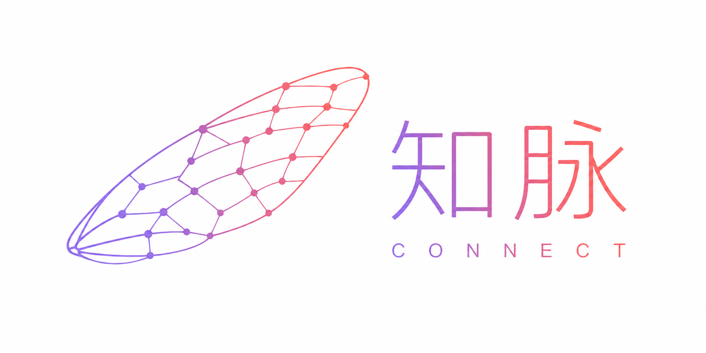
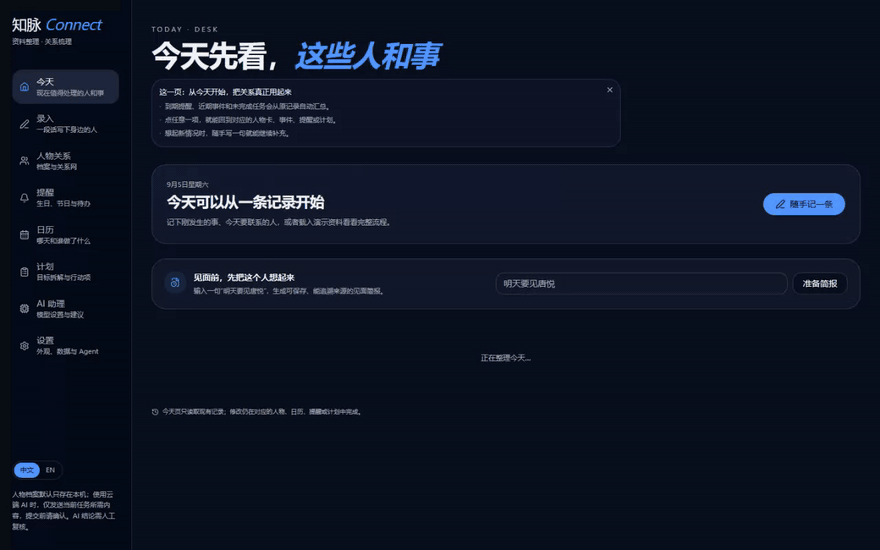
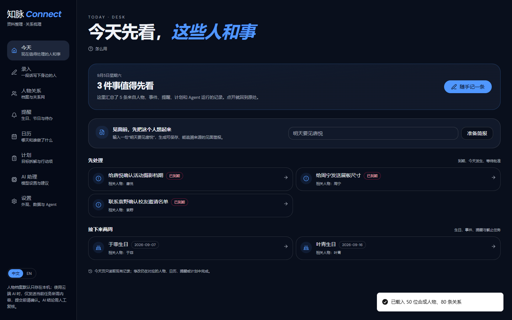
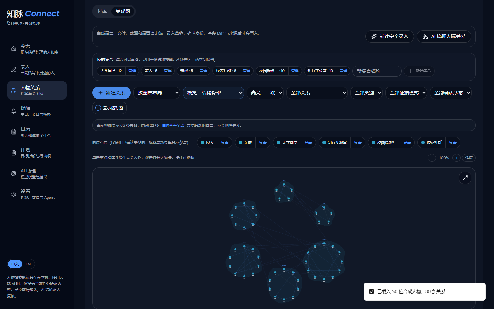
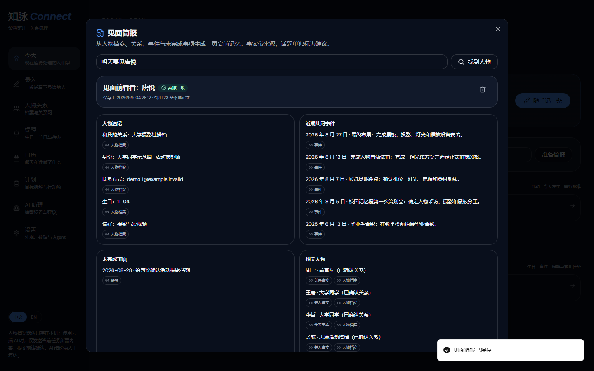
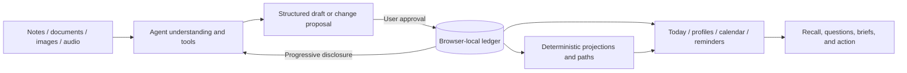

<p align="center">
  <picture>
    <source media="(prefers-color-scheme: dark)" srcset="src/assets/logo-with-text-dark.png">
    <source media="(prefers-color-scheme: light)" srcset="src/assets/logo-with-text.png">
    
  </picture>
</p>

<h1 align="center">Zhimai Connect</h1>

<p align="center">
  <strong>A personal relationship secretary that remembers people, context, and what comes next.</strong><br>
  Turn everyday notes, chat excerpts, documents, screenshots, and recordings into a traceable local record of people, relationships, events, and reminders.
</p>

<p align="center">
  <a href="https://zhimai-connect.zhimaiconnect.workers.dev/">Live demo</a> ·
  <a href="#three-minute-tour">Three-minute tour</a> ·
  <a href="#design-and-architecture">Architecture</a> ·
  <a href="#data-and-privacy">Privacy</a> ·
  <a href="README.md">中文</a>
</p>

<p align="center">
  
  
  
  
</p>

> [!NOTE]
> The current release is a local-first personal edition. Structured records stay in the visitor's browser. There is no account system, cloud contact database, or multi-device sync yet, so different browsers and devices do not share archives.

The Chinese name “知脉” joins _zhī_ — cicada and knowing — with _mài_, a network of relationships. The logo is a cicada wing whose intersecting veins become nodes in a relationship graph.

## Why it exists

Contact books store phone numbers. Calendars store dates. Notes store fragments. Real relationships span identity, shared history, changing distance, commitments, and the next appropriate action. Maintaining all of this through rigid forms costs more attention than most people can spare.

Zhimai accepts the language people already use. Write who someone is, how you met, what happened, and what should be remembered. An Agent turns that material into a structured draft. You review the changes once, then the approved facts enter the local ledger. Later questions disclose only the records needed for the current task.

## What it can do

- **Today workspace** — brings due reminders, upcoming events, unfinished tasks, recent interactions, and resumable Agent runs into one place. Every card opens the original record.
- **Natural intake** — accepts text, common documents, screenshots, and recordings; later input can update a draft or connect with an existing person.
- **People and relationships** — combines profiles, evidence, interactive graphs, circle layouts, Louvain topology, focus modes, and explicit referral policies.
- **Events and time** — links people to life events, birthdays, reminders, tasks, Gregorian dates, lunar dates, and fuzzy expressions such as “last summer.”
- **Meeting briefs** — turns “I am meeting Tang Yue tomorrow” into a saved page of profile facts, recent shared events, open items, related people, conversation ideas, and information gaps. Fact lines link back to their sources; source changes produce a new version without erasing the old one.
- **Who should I ask?** — lets a model understand an open-ended need while the local graph verifies candidates, paths, evidence, and referral eligibility.
- **Action planning** — produces an editable plan from a goal. Only the selected and approved actions enter the task ledger.
- **Ask the archive** — searches people, relationships, events, and circles, and can prepare change proposals. Public web, weather, date, and news tools stay separate from private archive disclosure.
- **Resumable Agent runs** — persists rounds, tool observations, proposals, checkpoints, and budgets. A 5xx response or page change does not force a completed tool sequence to start again.
- **Portable records** — exports and restores a validated `zhimai-connect/archive@2` machine archive. Markdown, Word, and PDF exports serve human reading rather than recovery.

## Product tour

<p align="center">
  
</p>

| Today workspace                                           | Relationship graph                                            | Traceable meeting brief                               |
| --------------------------------------------------------- | ------------------------------------------------------------- | ----------------------------------------------------- |
|  |  |  |

## Three-minute tour

Open the [live application](https://zhimai-connect.zhimaiconnect.workers.dev/). The first screen offers three paths: load a demo library, paste material, or begin with an empty archive.

The demo library contains four independent fictional scenarios:

- **Campus life** — classmates, clubs, an exhibition, and two people with the same name;
- **Family life** — relatives, birthdays, and derived kinship relationships;
- **Workplace collaboration** — colleagues, projects, meetings, and professional skills;
- **Small-business collaboration** — entrepreneurship, marketing, hiring, technology, and content delivery.

The complete demo joins all four into 50 synthetic people, 80 typed relationships, 25 shared events, and 3 reminders. All addresses use `example.invalid`, and records are marked as synthetic.

Try this route:

1. Start on **Today**, then open a reminder or event from its source-linked card.
2. Enter “明天要见唐悦” and save a meeting brief.
3. Open **People**, switch between circle and topological layouts, and focus one person.
4. Ask **Who should I ask?** for help with a concrete task and inspect the path and reasons.
5. Ask the archive to change a person or relationship, approve the proposal, then undo the batch.

## Design and architecture

### Understanding belongs to the model; facts to the ledger; approval to the person

Models interpret flexible language. Local code stores and computes stable facts. The user controls the final write.



Approval is a reversible receipt. It shows what will be added, changed, or removed, supports one-signature batches, and records an undo point. Ordinary uncertainty stays visible as evidence or an “unverified” label; it does not trap the user in a verification loop.

### Assertions and projections have different lifecycles

| Object                                  | Persisted | Role                                                                   |
| --------------------------------------- | --------- | ---------------------------------------------------------------------- |
| `relationAssertions`                    | Yes       | Confirmed or source-supported relationship facts, each with provenance |
| Derived relationship projection         | No        | Recomputed from current assertions and their supporting IDs            |
| `collections` / `collectionMemberships` | Yes       | User-maintained or approved circle membership                          |
| Topological communities                 | No        | A graph layout calculated for browsing                                 |
| View and referral policies              | Yes       | Control visibility and referral eligibility without rewriting facts    |
| Meeting brief versions                  | Yes       | Source-linked snapshots that become stale when their inputs change     |

Removing a source assertion causes dependent kinship projections to disappear on recomputation. The archive does not keep unsupported “ghost edges.”

### One Agent harness

Intake, recommendations, archive questions, and planning share the same tool registry, budgets, run ledger, checkpoints, and commit path. A typical request first searches an index, then reads only the matched profiles, relationships, or events. Tool observations are reused while their source revisions remain valid.

Stable domain tools search people, read relationships, find events, compute paths, access public information, and prepare typed mutation plans. Output claims use shared categories such as `fact`, `gap`, `advice`, `language`, and `uncertain`.

## Run locally

Requirements: Node.js `>=22.12.0`, npm `>=10.9.0`.

```sh
git clone https://github.com/iyau76/ZhiMaiConnect.git
cd ZhiMaiConnect
npm ci
cp .env.example .env.local
npm run dev
```

On PowerShell, replace the copy command with:

```powershell
Copy-Item .env.example .env.local
```

The terminal prints the development URL. Profiles, graphs, calendars, reminders, archives, and local algorithms work without a cloud model key. AI features can also use a local Ollama endpoint.

## Models

| Provider                                                                    | Configuration                                            | Data path                                              |
| --------------------------------------------------------------------------- | -------------------------------------------------------- | ------------------------------------------------------ |
| OpenAI-compatible endpoint                                                  | Endpoint URL, model name, and API key                    | Restricted same-origin proxy to an approved HTTPS host |
| [Gemini OpenAI compatibility](https://ai.google.dev/gemini-api/docs/openai) | Official compatible endpoint; default `gemini-3.7-flash` | Restricted same-origin proxy to Google Gemini          |
| Ollama                                                                      | Local endpoint configured in the model page              | Browser to the user's local model service              |

Keep real keys in the ignored `.env.local` file. Production credentials belong in Cloudflare Secrets. Never give browser-exposed variables a `VITE_` prefix.

## Data and privacy

- People, relationships, events, reminders, circles, and preferences live in the current browser's IndexedDB by default.
- Clearing site data removes the local archive. Export a JSON machine backup regularly and treat it as a sensitive file.
- A cloud model receives only the text, media, or progressively disclosed archive fragments needed for the current task, after the corresponding transfer consent.
- Public web and weather tools receive public queries or locations, without private profile context.
- Private log payloads are off by default. The regular run log keeps status, rounds, tool names, duration, and token estimates.
- Zhimai does not read personal WeChat, QQ, or Xiaohongshu accounts and does not send messages on the user's behalf.
- Account login and multi-device sync are not part of the current release. Use the JSON archive to move data manually.

## Development and verification

Stack: React 19, TypeScript, TanStack Start/Router, Vite 8, Tailwind CSS 4, Radix UI, IndexedDB, Vitest, Playwright, and a Cloudflare Module Worker target.

| Command           | Purpose                                                        |
| ----------------- | -------------------------------------------------------------- |
| `npm run dev`     | Start the development server                                   |
| `npm run check`   | TypeScript, ESLint, Prettier, and Vitest                       |
| `npm run e2e`     | Run browser end-to-end tests                                   |
| `npm run build`   | Produce the Cloudflare Worker build                            |
| `npm run preview` | Preview the production build at `127.0.0.1:4173` with Wrangler |

Key source locations:

- `src/lib/face-db.ts` — IndexedDB model, versions, and transaction boundary;
- `src/lib/agent-runtime.ts` — shared round, tool, token, and time budgets;
- `src/lib/archive-agent-tools.ts` — common archive, recommendation, and public tools;
- `src/lib/mutation-commit-coordinator.ts` — proposals, receipts, atomic commits, and undo;
- `src/lib/today-projection.ts` — source-linked Today projection;
- `src/lib/meeting-brief.ts` — versioned meeting brief snapshots;
- `src/lib/kinship-projector.ts` — derived kinship projection;
- `src/lib/archive-data.ts` — `archive@2` validation, migration, and recovery;
- `e2e/` — browser isolation, recovery, resume, and core-flow tests.

Read [AGENTS.md](AGENTS.md) before changing the project. It records the product boundaries, data invariants, Agent contract, writing rules, and release gates. The wider documentation index is at [doc/README.md](doc/README.md).
