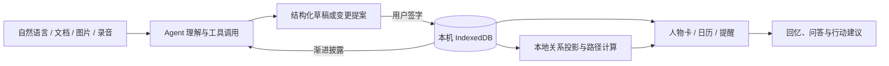

<p align="center">
  <picture>
    <source media="(prefers-color-scheme: dark)" srcset="src/assets/logo-with-text-dark.png">
    <source media="(prefers-color-scheme: light)" srcset="src/assets/logo-with-text.png">
    
  </picture>
</p>

<h1 align="center">知脉 Connect</h1>

<p align="center">
  <strong>一位懂你，也懂人情世故的个人关系秘书。</strong><br>
  把聊天摘录、个人印象、文档、截图和录音整理成人物、关系、事件与提醒；需要回忆、联系或修改时，再让 AI 按需查档。
</p>

<p align="center">
  <a href="https://zhimai-connect.zhimaiconnect.workers.dev/">在线体验</a> ·
  <a href="#快速体验">快速体验</a> ·
  <a href="#设计与架构">设计与架构</a> ·
  <a href="#数据与隐私">数据与隐私</a> ·
  <a href="doc/README.md">项目文档</a> ·
  <a href="README.en.md">English</a>
</p>

<p align="center">
  
  
  
  
</p>

> [!NOTE]
> 当前版本是本地优先的个人版：结构化档案保存在当前浏览器或安装版的本机应用存储中，项目没有账号系统、云端人物数据库或多设备同步。不同应用入口和不同设备不会自动共享档案。

“知”取自知了，“脉”取自人脉。Logo 是一片知了的脉翅，翅脉的交汇点也是关系图中的节点。

## 它解决什么问题

通讯录适合保存号码，日历适合保存日期，备忘录适合保存片段。真实的人际关系会同时涉及身份、往来、共同事件、亲疏变化和下一步行动，靠细致填表维护很快就会成为负担。

知脉 Connect 接受日常语言。用户可以直接写下“她是谁、我们怎么认识、最近发生了什么、以后要记得什么”，AI 把材料拆成结构化草稿；用户核对差异后一次签字，档案才进入本地账本。后续查询仍由 Agent 按需读取，不需要把整个人物库一次性交给模型。

## 从一段话到可行动的档案

| 步骤          | 用户看到什么                                                   | 系统做什么                                         |
| ------------- | -------------------------------------------------------------- | -------------------------------------------------- |
| 1. 随手写下   | 输入自然语言，或导入 TXT、MD、CSV、JSON、PDF、DOCX、图片和录音 | 读取材料，建立本轮整理任务                         |
| 2. AI 整理    | 人物、关系、事件、提醒和依据组成的草稿                         | Agent 先查已有索引，再按需读取档案，识别新增与更新 |
| 3. 核对入库   | 差异摘要、待核验项、逐条或一键接受                             | 本地校验稳定 ID，在单一事务中提交并生成可撤销收据  |
| 4. 回忆与行动 | 关系图、人物卡、日历、提醒、行动计划、“这事该拜托谁”和“问一问” | 从已批准事实计算关系投影、路径、任务和建议         |

### 当前能力

- **今天工作台**：打开应用先看到到期提醒、近期事件、未完成任务与可继续的 Agent 运行；每张卡片都回到同一条源记录，不复制第二套状态。
- **自然录入**：支持纯文本、常见文档、截图和现场录音；多轮整理可以联系已有档案，也能修改已暂存的草稿。
- **人物与关系**：人物卡、关系依据和交互式关系图；支持圈层布局、Louvain 拓扑社区、不分组布局、一跳/两跳聚焦、全屏查看及单边常显/自动/常隐。
- **事件与时间**：人物关联事件、生日、节日、待办与提醒统一进入时间视图；日历同格显示公历和农历，也能保存“去年夏天”这类模糊日期。
- **人际协作建议**：“这事该拜托谁”支持开放找人和目标人物引荐。开放任务由模型拆解所需能力，本地档案负责锁定候选；目标任务根据已确认关系和引荐策略计算路径，AI 负责解释证据与风险。
- **行动规划**：在“计划”页写下目标，Agent 按需查询人物、关系和事件，将目标拆成可编辑的行动草案。用户可以调整标题、优先级、截止日期和参与人物；只有选中并批准的项目才会一次性写入任务账本。
- **档案 Agent**：“问一问”可以检索人物、关系、事件和圈层，也能查询日期、天气、近期资讯与公开网页。修改人物、关系、事件、圈层或删除人物时，模型先生成待批准计划。
- **运行轨迹**：录入、推荐、问答和行动规划使用一致的可展开轨迹，区分模型摘要、工具步骤、校验、完成与错误；完整轮次、工具调用和预算仍由统一运行账本记录。
- **持续会话**：上一轮仍有效的工具结果会进入工作记忆；模型遇到 5xx 或超时后保留检查点，用户可以从中断轮次继续。较早对话被压缩时，界面会给出提示。
- **见面简报**：输入“明天要见唐悦”，即可保存人物速记、近期共同事件、未完成事项、相关人物与可聊话题；每条事实能回到来源，档案变化后生成新版，旧版仍可查看。
- **可恢复数据**：JSON 完整备份使用 `zhimai-connect/archive@2`；Markdown、Word 和 PDF 用于阅读与交付。完整恢复会预览记录数量并从事实重新计算派生关系。
- **个人化界面**：中英文、主题、字号、减少动画和基础键盘/无障碍设置。
- **手机与电脑入口**：网页可安装为 PWA，另提供 Windows / Android 安装版构建；移动底部导航、拍照、录音和本机材料收件箱共用同一套录入流程。离线时先记录，联网后由用户继续整理。

## 产品一览

<p align="center">
  
</p>

| 今天：把人和事带回行动                               | 关系网：圈层与关系同屏                            | 见面简报：事实可回溯                             |
| ---------------------------------------------------- | ------------------------------------------------- | ------------------------------------------------ |
|  |  |  |

## 设计与架构

### 理解归模型，事实归账本，批准归人

模型擅长理解自由文本，本地程序擅长稳定地保存和计算，用户掌握最终写入权。知脉 Connect 将三者放在同一条可追溯流程中：



批准界面是一张变更收据：它列出将新增、修改和删除的记录，支持批量批准和整批撤销。普通不确定性以依据和软提醒呈现，不会在 Agent 循环中反复拦截答案。

### 事实断言与派生投影分开保存

关系库中最容易积累的错误，是把材料事实和算法推导混在一起。当前数据模型给它们不同的生命周期：

| 对象                                         | 是否持久保存 | 说明                                              |
| -------------------------------------------- | ------------ | ------------------------------------------------- |
| 关系断言 `relationAssertions`                | 是           | 用户确认或材料明确支持的关系事实，保留来源与证据  |
| 派生关系 projection                          | 否           | 由当前投影器从断言重新计算，并记录支持它的断言 ID |
| 圈层 `collections` / `collectionMemberships` | 是           | 用户或经批准的 AI 提案维护的群体归属              |
| 拓扑社区                                     | 否           | 根据图结构计算的浏览视图，不写回人物事实          |
| 展示偏好与引荐策略                           | 是           | 控制画面和路径资格，不改变关系事实本身            |

源断言被修改或删除后，依赖它的祖孙、兄弟姐妹等投影会在重算时消失，关系库不会留下脱离依据的“幽灵边”。

### Agent Loop 与渐进披露

录入 Agent、推荐 Agent、“问一问”和行动规划 Agent 共用工具注册表、预算、运行日志和错误恢复。典型查询会先浏览人物索引，再读取命中的人物、关系或事件；档案规模扩大后，模型上下文仍只包含当前问题需要的部分。运行时的模型摘要、工具步骤和校验结果可在界面展开查看，详细用量与结束状态由同一运行账本投影。

工具表达稳定的领域能力：查人物、读关系、找事件、计算路径、查询公开信息、生成批量变更计划。模型输出经过 `fact`、`gap`、`advice`、`language`、`uncertain` 等声明类型进入界面，单条依据异常不会吞掉整段回答。

## 快速体验

### 选择使用入口

| 入口              | 如何开始                                                          | 离线与网络                               |
| ----------------- | ----------------------------------------------------------------- | ---------------------------------------- |
| 网页              | 打开[在线应用](https://zhimai-connect.zhimaiconnect.workers.dev/) | 首次加载需要网站可访问                   |
| PWA               | 网页中进入“设置 → 安装到手机或电脑”                               | 完成离线准备后可断网查看、编辑和记录材料 |
| Windows / Android | 构建并安装 EXE / APK，见下方说明                                  | 页面随包交付，模型请求直接访问配置的服务 |

各入口免登录。AI 整理需要可访问的模型接口，资料通过 JSON 完整备份手动迁移，不自动跨设备共享。

### Windows / Android 安装版

安装版内置页面资源，免登录保存和管理本机资料；AI 请求直接访问自己配置的模型接口。无需通过 Cloudflare 加载应用页面，各设备通过 JSON 完整备份迁移资料。

开发者可运行 `npm run package:windows` 或 `npm run package:android`，产物位于 `release/windows/` 和 `release/android/`。构建 Android 需要 JDK 21 和 Android SDK；手机运行需要 Android 7.0+、WebView 111+。当前 APK 使用测试签名，Windows 安装程序尚未配置发布者签名。构建与测试说明见 [安装版文档](doc/architecture/Windows与Android安装版.md)。

安装包目前由本机构建提供，未发布公共下载；仓库包含完整构建源码。手机首次打开后，在 AI 助理中配置 HTTPS 模型接口，或先载入演示资料体验离线功能。

### 在线使用

打开 [zhimai-connect.zhimaiconnect.workers.dev](https://zhimai-connect.zhimaiconnect.workers.dev/)。首次进入有三条路：载入演示库、粘贴一段材料，或从空库开始。演示库包含四套可独立载入的虚构场景：

- **校园生活**：同学、社团、展览与两位同名人物；
- **家庭往来**：家人、亲戚、生日与亲属关系推导；
- **职场协作**：同事、项目、会议与专业能力；
- **小企业协作**：创业、市场、招聘、技术与内容交付。

“载入完整 50 人演示库”会把四类生活场景连接成 80 条类型化关系、25 条共同事件和 3 条提醒，适合体验跨圈引荐、同名消歧和关系图布局。

载入后可直接尝试：

1. 从“今天”查看近期的人和事，点卡片回到原始提醒、事件或任务；
2. 输入“明天要见唐悦”，生成一份有来源、有版本的见面简报；
3. 在人物关系页切换“按圈层布局”和“按拓扑社区布局”，点击人物查看一跳关系；
4. 在提醒页询问一件具体任务，观察“这事该拜托谁”的候选、路径和理由；
5. 在 AI 助理中要求修改人物或关系，核对待批准提案，批准后再整批撤销。

演示资料只写入当前浏览器的 IndexedDB。“只清除合成数据”按稳定 ID 删除演示记录，不影响用户自行录入的资料。

### 本地运行

环境要求：Node.js `>=22.12.0`、npm `>=10.9.0`。项目以 `package-lock.json` 作为依赖基线。

```powershell
git clone https://github.com/iyau76/ZhiMaiConnect.git
cd ZhiMaiConnect
npm ci
Copy-Item .env.example .env.local
npm run dev
```

macOS 或 Linux 使用：

```sh
git clone https://github.com/iyau76/ZhiMaiConnect.git
cd ZhiMaiConnect
npm ci
cp .env.example .env.local
npm run dev
```

终端会显示开发服务器的实际地址。没有配置云端模型密钥时，人物档案、关系图、日历、提醒、备份和本地算法仍可使用；AI 功能可以改用本机 Ollama。

## 模型与环境变量

知脉 Connect 支持三种模型来源。下表中的代理路径适用于网页 / PWA：

| 来源                                                            | 适用方式                                  | 数据路径                            |
| --------------------------------------------------------------- | ----------------------------------------- | ----------------------------------- |
| OpenAI 兼容接口                                                 | 用户填写接口地址、模型名和 API Key        | 经受限同源代理访问获准的 HTTPS 主机 |
| [Gemini 兼容接口](https://ai.google.dev/gemini-api/docs/openai) | 默认使用官方兼容端点与 `gemini-3.7-flash` | 经受限同源代理访问 Google Gemini    |
| Ollama                                                          | 用户运行本地模型并在模型设置中填写地址    | 浏览器直接访问用户配置的本地服务    |

Windows / Android 安装版通过原生网络直接访问配置的模型端点，无需网站代理，安装包不包含 API Key。Windows 可连接本机 HTTP Ollama；Android 当前使用 HTTPS 接口，手机的 `localhost` 指手机自身。

在 AI 助理中填写配置后，可点击“保存模型配置”保存在当前设备。保存在浏览器或安装版中的密钥尚未接入系统凭据库；共享设备不宜保存个人密钥。

`.env.example` 只包含变量名。真实密钥放入未提交的 `.env.local`，生产密钥使用 Cloudflare Secret。

| 变量                     | 用途                                    | 必需 |
| ------------------------ | --------------------------------------- | ---- |
| `AI_PROXY_ALLOWED_HOSTS` | AI 代理允许访问的额外精确主机名         | 否   |
| `ZHIMAI_RATE_LIMIT_SALT` | Cloudflare 边缘限流客户端标识的伪名化盐 | 否   |

`AI_PROXY_ALLOWED_HOSTS` 只填写主机名，不包含协议、端口或路径。代理拒绝通配符、IP 字面量、本地域名和非 HTTPS 地址。密钥不要使用 `VITE_` 前缀，这类变量会进入浏览器构建产物。

Ollama 需要允许当前网页来源访问。只为可信的本机环境配置 `OLLAMA_ORIGINS`，不要把本地模型服务直接开放到公网。

## 数据与隐私

### 浏览器安装（PWA）与离线使用

打开知脉后，在“设置 → 安装到手机或电脑”查看安装方式与离线准备状态。支持的浏览器可将知脉安装到主屏幕，无需登录。完成离线准备后，可以断网查看、编辑本机档案和记录文字；离线导入的文件、拍照材料与录音先保存在“待整理材料”中，联网后由你点击继续。

Android PWA 的系统分享入口可把文字和文件交给已安装的知脉，具体以浏览器支持为准；APK 暂未提供系统分享接收入口。AI 整理、图片识别和录音转写需要对应服务可用。未提交材料不随 JSON 完整备份导出，请先完成整理或另存原文件。

首次安装仍需网站可访问；安装不会让手机和电脑自动同步，也不提供关闭应用后的定时通知。技术与测试说明见 [PWA 与本机材料](doc/architecture/PWA与本机材料.md)。

- 人物、关系、事件、提醒、圈层和偏好默认保存在当前浏览器或安装版的本机 IndexedDB；服务端没有用户人物数据库。
- 清理浏览器站点数据或卸载 Android 应用会删除本地档案。正式录入前后应定期导出 JSON 完整备份，并将备份当作敏感文件保管。
- 选择云端模型后，完成当前任务所需的文字、图片、音频和按需读取的档案片段会发送给相应模型服务商。界面会在新的数据类型首次上云前请求确认。
- 联网工具只发送公开检索词或地点，不把本地人物档案附在天气、新闻和网页搜索请求中。
- Agent 私密日志正文默认不保存；常规运行日志记录轮次、工具名、耗时、token 估算和状态。
- 关系的“常隐”只控制画面。引荐资格由独立策略控制，目标路径在浏览器中根据账本计算。
- 应用不会读取个人微信、QQ 或小红书账号，也不会替用户自动向外发送消息。
- 当前没有登录、多设备同步、安装包自动更新或关闭应用后的定时系统通知。需要换浏览器或设备时，使用 JSON 完整备份手动迁移。Android PDF、相机和麦克风仍需真机验收，模拟器测试范围见 [安装版说明](doc/architecture/Windows与Android安装版.md)。

## 开发与验证

技术栈：React 19、TypeScript、TanStack Start/Router、Vite 8、Tailwind CSS 4、Radix UI、IndexedDB、Vitest、Playwright；网页部署到 Cloudflare Workers，Windows 使用 Electron，Android 使用 Capacitor。

| 命令                      | 用途                                         |
| ------------------------- | -------------------------------------------- |
| `npm run dev`             | 启动开发服务器                               |
| `npm run typecheck`       | TypeScript 静态检查                          |
| `npm run lint`            | ESLint，警告也会导致失败                     |
| `npm run format:check`    | 检查 Prettier 格式                           |
| `npm run test:run`        | 单次运行 Vitest 测试                         |
| `npm run check`           | 依次运行类型、Lint、格式和单元测试           |
| `npm run e2e`             | 运行 Playwright 端到端测试                   |
| `npm run e2e:pwa`         | 生产构建上的离线、分享与移动端专项测试       |
| `npm run build:native`    | 构建安装版共用的前端资源                     |
| `npm run desktop:dev`     | 打开桌面开发壳，需先构建原生前端             |
| `npm run e2e:desktop`     | 桌面独立资料目录中的启动、离线与导出测试     |
| `npm run package:windows` | 构建 Windows x64 NSIS 安装包                 |
| `npm run package:android` | 构建 Android 测试 APK                        |
| `npm run build`           | 生成 Cloudflare Worker 产物                  |
| `npm run preview`         | 用 Wrangler 在 `127.0.0.1:4173` 预览生产构建 |

生产构建位于 `.output/`。`npm run preview` 使用项目生成的 `.output/server/wrangler.json`，不能用普通 `vite preview` 代替。

## Cloudflare 部署

从已验证的 `main` 分支构建部署。首次部署时登录 Wrangler 并配置所需 Secret；后续更新保留已有 Secret，无需每次重新输入。

```powershell
npm run check
npm run build
npm run e2e
npm run e2e:pwa
npx wrangler deploy --config .output/server/wrangler.json
```

构建脚本会给 Worker 注入三组 Cloudflare Rate Limiting bindings，并生成 PWA 离线资源清单。首次配置伪名化盐可运行 `npx wrangler secret put ZHIMAI_RATE_LIMIT_SALT --config .output/server/wrangler.json`。每次部署都应重新构建并核对线上 Worker 版本、静态资源和 `sw.js` 中的 PWA 指纹。

网页的新版本下载完成后，保存工作并关闭所有知脉窗口，再打开即可启用；更新不会主动刷新正在编辑的页面。EXE / APK 需另行打包和安装，Cloudflare 部署不会更新已安装的客户端。

## 源码导航

| 位置                                                  | 职责                                                |
| ----------------------------------------------------- | --------------------------------------------------- |
| `src/components/`                                     | 录入、人物关系、提醒、日历、计划、AI 助理与设置界面 |
| `src/components/workspace.tsx`                        | 网页和安装版共用的应用入口                          |
| `src/lib/local-capture-store.ts`                      | 本机原始材料收件箱与一次追加                        |
| `src/lib/pwa-client.ts` / `scripts/build-pwa.mjs`     | 浏览器安装、离线准备和更新生命周期                  |
| `src/lib/native-runtime.ts` / `src/lib/native-api.ts` | 原生流式网络、文件保存和模型请求适配                |
| `src/lib/provider-protocol.ts`                        | 网页与安装版共用的模型请求与响应格式                |
| `desktop/` / `android/` / `native/`                   | Windows、Android 宿主与安装版前端                   |
| `src/lib/face-db.ts`                                  | IndexedDB 数据模型、版本与事务入口                  |
| `src/lib/today-projection.ts`                         | 从源记录投影“今天”工作台                            |
| `src/lib/meeting-brief.ts`                            | 可追溯、版本化的见面简报                            |
| `src/lib/demo-data.ts`                                | 四个生活场景与 50 人综合演示库                      |
| `src/lib/archive-agent-tools.ts`                      | Agent 共用的档案、推荐与联网工具注册表              |
| `src/lib/agent-runtime.ts`                            | 统一轮次、工具、token 和时限预算                    |
| `src/lib/mutation-commit-coordinator.ts`              | 变更提交、收据和整批撤销                            |
| `src/lib/relation-ontology.ts`                        | 关系谓词、方向与语义定义                            |
| `src/lib/kinship-projector.ts`                        | 从已确认断言计算亲属派生关系                        |
| `src/lib/archive-data.ts`                             | `archive@2` 导出、校验、迁移和恢复计划              |
| `src/lib/intake-agent.ts`                             | 多轮自然语言录入 Agent                              |
| `src/lib/recommendation-agent.ts`                     | “这事该拜托谁”的任务理解与档案披露                  |
| `src/lib/planning-agent.ts`                           | 目标拆解、按需查档和待批准行动草案                  |
| `src/lib/assistant-agent.ts`                          | “问一问”、工具记忆和修改提案                        |
| `src/routes/api/`                                     | 模型、转写与联网工具的同源服务端路由                |
| `e2e/`                                                | 浏览器隔离、恢复、断点续跑和核心流程测试            |

开始修改前请阅读 [AGENTS.md](AGENTS.md)。它记录了产品边界、数据不变量、Agent 工具规范、写作要求和发布检查。

## 项目文档

- [文档索引](doc/README.md)
- [产品哲学与架构判据](doc/product/中期反思.md)
- [机器归档格式 v2](doc/architecture/机器归档格式-v2.md)
- [PWA 与本机材料](doc/architecture/PWA与本机材料.md)
- [Windows 与 Android 安装版](doc/architecture/Windows与Android安装版.md)
- [持续验收记录](doc/quality/ACCEPTANCE_LOG.md)
- [亲属关系推理回归样例](doc/quality/亲属关系推理-红楼梦测试样例.md)
- [关系图与引荐算法调研](doc/research/文献调研-关系网与推荐.md)

阶段性计划和已经被实现取代的报告位于 `doc/history/`。身份信息、参赛材料、原始聊天和本机审计保存在 Git 忽略的 `doc/background/`；视频工程同样不进入应用代码仓库。
