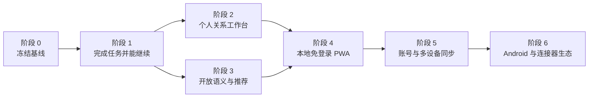

# 知脉 Connect 分阶段升级计划

> 制定日期：2026-09-02
>
> 适用阶段：初评期间至产品化早期
> 估时口径：单人专注开发日，不含平台审核、应用商店审核和外部接口等待时间

本计划综合当前代码、产品哲学、Agent harness 审计和同届项目调研。目标是把知脉从功能较全的关系资料工具推进为可持续使用的个人关系工作台。每个阶段同时交付一项用户能感知的结果和支撑它的结构，阶段验收通过后再进入下一层依赖。

参考基线：

- [中期反思](中期反思.md)
- [总复盘报告](../background/总复盘报告.md)
- [Agent harness 结构审计](../quality/Agent-harness结构审计-2026-09-02.md)
- [同届参赛项目横向调研](../research/peerworks/参赛项目横向调研与知脉改进启示-2026-09-02.md)
- [机器归档格式 v2](../architecture/机器归档格式-v2.md)

## 一、升级顺序



阶段 2 和阶段 3 可以先后交错，但都依赖阶段 1。移动端会放大会话丢失和引用错误，因此阶段 4 必须建立在可恢复 run 与稳定提案之上。账号和云同步需要单一事实账本、版本与冲突协议，安排在移动使用路径得到验证之后。

## 二、总览

| 阶段 | 建议工作量 | 用户得到什么 | 主要结构产出 | 发布门槛 |
| --- | ---: | --- | --- | --- |
| 0. 冻结基线 | 1–2 天 | 当前线上版本可稳定体验 | 可复现档案、指标和迁移基线 | 全量检查、云端冒烟、归档恢复通过 |
| 1. 完成任务并能继续 | 4–7 天 | 全库整理可完成，切页/刷新后可继续 | 语义引用解析、执行账本、上下文账本 | 50/500 人批处理与故障恢复通过 |
| 2. 个人关系工作台 | 4–7 天 | 打开即看到今天要处理的人和事 | Today projection、事件关联、可保存产物 | 三分钟闭环和跨页面编辑通过 |
| 3. 开放语义与推荐 | 4–7 天 | 能找到措辞不同、路径更远的合适人选 | 语义召回、证据板、自动路径策略 | 同义召回、4–5 跳路径和失败降级通过 |
| 4. 本地免登录 PWA | 5–8 天 | 手机安装、离线记录、分享材料、管理资料 | 应用离线缓存、材料收件箱、移动导航 | 生产构建离线验收与手机实机验证 |
| 5. 账号与多设备同步 | 10–15 天 | 换设备后继续使用，仍可保持本地模式 | 身份、设备、加密、outbox、冲突协议 | 双设备同步、撤销与恢复演练通过 |
| 6. Android 与连接器生态 | 按验证结果排期 | 更深的系统入口和校园/企业场景 | Capacitor、授权连接器、来源治理 | 由真实使用数据和合作条件决定 |

## 三、阶段 0：冻结可复现基线

### 目标

给后续重构建立一个可以比较、回滚和恢复的起点。该阶段只做基线收口和阻断性缺陷修复。

### 工作内容

1. 固定三套脱敏 `archive@2`：空库、50 人生活库、500 人压力库；每套包含人物、关系、集合、事件、提醒和预期不变量。
2. 固定五条主流程：自然语言录入、全库圈层整理、问一问、这事该拜托谁、修改后撤销。
3. 记录当前主分支、生产 Worker 版本、构建指纹和浏览器数据库版本。
4. 为归档导入、升级和恢复建立自动校验：稳定 ID、引用完整性、事实与投影数量、孤儿记录。
5. 统一测试结果目录命名，真实 API 日志只保存脱敏正文、provider、模型、预算、步骤和错误分类。
6. 列出低优先模块的维护策略。人脸、声纹、调查、企业项目等已有能力暂时只修阻断性错误，不继续扩展。

### 验收门槛

- `npm run check`、`npm run build`、`npm run e2e` 全绿；
- 三套归档完成“导出 → 清库 → 导入 → 投影重建 → 不变量比较”；
- 本地和 Cloudflare 公开地址完成同一套五流程冒烟；
- 测试夹具、日志和提交中没有真实联系人或 API Key；
- 新缺陷能够归到数据、执行、交互或外部传输中的一个明确层级。

## 四、阶段 1：让任务完成，并且能够继续

这是当前最高优先级。它直接解决“任务计划不符合执行契约”、切页后状态消失、修正轮重复采样和工具结果重复读取。

### 1.1 录入状态机重构

把录入流程统一为：

```text
UNDERSTAND → DISCOVER → RESOLVE → PROPOSE → APPROVE → COMMIT
```

- 模型输出“周明远加入同事圈”这类语义 `recordRef`，不复制 UUID；
- 本地 resolver 统一处理姓名、别名、当前人物、ego、集合和分页；
- 多候选引用只把歧义项交给用户，其余项目继续形成提案；
- collection 与 membership 成为 mutation 的正式 domain；
- 全库任务由本地枚举目标，模型负责分类或解释，本地按稳定 ID 编译批次；
- 修正轮必须获得候选、更多档案、工具结果或缩小后的失败子集。

### 1.2 执行账本

在 IndexedDB 增加一等 `agentRuns` 及关联记录：

- run：入口、用户请求、provider、预算、状态、开始/结束时间；
- step：模型请求、工具调用、解析、提案、批准、提交；
- observation：工具结果、数据版本、游标、被省略字段；
- checkpoint：下一安全步骤、累计预算、未完成请求和依赖版本；
- proposalRef / receiptRef：连接待批准提案、提交收据和撤销记录。

页面只订阅这些记录。切页、刷新或重新打开时，按 run ID 恢复；继续执行只重试未完成步骤。两个标签同时继续同一 run 时使用租约或 CAS 防止重复副作用。

### 1.3 上下文账本

记录已经披露给模型的记录 ID、字段、版本、游标和遗漏原因。对话压缩保留用户约束、已经确认的结论、排除条件、待消歧项和未完成行动。工具 observation 按记录依赖失效，无关档案变化不再清空全部记忆。

### 用户结果

- “整理所有人的圈层”不会因末页人物或一个坏引用整批失败；
- 离开 AI 页面再回来，聊天、工具结果、进度和提案仍在；
- 503 或超时后从最后一个安全 step 继续；
- 运行详情能解释读取了多少记录、遗漏了什么、停在哪里。

### 验收门槛

- 在 50 人和 500 人档案中完成全库圈层整理，模型输出中不出现稳定 UUID；
- 人物位于任意分页位置时，四个 Agent 入口解析到同一 ID；
- 一个歧义或非法项不阻塞其余提案；
- 在第 3、5、8 个模型步骤注入 503，恢复后不重复已完成工具和写入；
- 刷新、关闭标签、浏览器重启后可恢复 run、工具结果和未批准提案；
- 日志区分 transport、budget、context omission、contract 和 transaction。

## 五、阶段 2：建立“今天”与个人关系工作台

### 目标

让用户每天打开知脉时先看到需要处理的人和事。人物库、关系图和 Agent 控制中心继续存在，但不再承担首页职责。

### 2.1 “今天”首页

汇总现有数据形成只读 projection：

- 今天和近期的生日、纪念日、提醒与事件；
- 未兑现承诺、长期未回访人物和需要确认的信息；
- 待批准提案、暂停 run 和上次未完成的整理；
- 快速录入：一句话、录音、图片或文件；
- 最近发生的关系变化与已经完成的互动。

每一项必须能跳转到对应人物、事件、提醒、提案或 run。首页不复制数据，也不创造第二套任务状态。

### 2.2 事件闭环

- 事件使用稳定 ID 连接人物、来源、提醒和任务；
- 时间线支持查看、编辑、删除和补充参与人物；
- “去年夏天”保留原始表达和解析范围，用户可以随后补充日期；
- 删除人物时显示事件、提醒、任务和证据引用的处理预览；
- 完成提醒后可补记结果，形成下一次见面可用的互动记录。

### 2.3 第一个工作台产物：见面简报

用户选择一个人或一句“明天要见唐悦”，生成一页可保存简报：怎么认识、近期事件、未完成承诺、相关人物、可聊话题和资料缺口。具体事实从本地账本渲染，建议和推断单独标注。简报保存引用 ID 与生成时的数据版本；源事实变化后显示“可更新”，旧版本仍可查看。

### 2.4 首次体验与仓库门面

- 首次进入提供“载入演示库 / 粘贴材料 / 从空库开始”；
- 固定校园、家庭、职场和小企业四个场景包；
- 根 README 增加真实 GIF、三张结果截图、三分钟体验与 `README.en.md`；
- 产品主叙事统一为“记下 → 理清 → 用上 → 记住变化”。

### 验收门槛

- 新用户三分钟内完成“录入 → 批准 → 查看人物/事件 → 生成简报”；
- Today 卡片与底层记录数量一致，没有复制出的影子状态；
- 用户能从人物、时间线和 Today 三个入口编辑同一事件；
- 修改源事实后，简报明确提示更新，重算后引用可追溯；
- 删除人物的预览与执行不留下事件、提醒或证据孤儿。

## 六、阶段 3：开放语义召回与关系推荐

### 目标

让模型参与开放任务理解和候选发现，本地账本负责证据、路径、权限与稳定排序。当前 `recommendation.ts` 已有语义 slot 与本地验证方向，先用回归实验确认覆盖范围，再补齐缺口。

### 工作内容

1. 模型把“活动摄影”“现场拍摄”“拍照记录”等需求归纳成语义能力槽，并提出检索表达或候选；
2. 本地从完整档案验证每个候选的事实依据、信息时间和来源；
3. 词面命中作为排序证据，不承担候选准入；
4. 路径按图规模自动搜索，默认上限扩展到 5 跳，并列出每一跳 assertion；
5. 缺联系方式、互动或亲密度时降低推荐可执行性并解释具体缺口；
6. 本地已有候选时先渲染候选与证据，模型解释失败只影响话术；
7. 问一问复用上下文账本，较早约束、已查档案和工具结果不会因八轮截断消失；
8. `fact`、`gap`、`advice`、`language`、`uncertain` 继续使用统一输出通道，不为单条测试问题新增专用工具。

### 可见产品

- 候选榜：同名或近似候选及其排除依据；
- 引荐路径卡：联系人、每一跳关系、可执行性和信息时间；
- 关系侦探报告：围绕一段关系的事件、承诺和候选解释；
- 推荐反馈：标错后定位到具体人物、关系或事件并生成修改提案。

### 验收门槛

- 同义能力、口语表达和组合需求能进入候选核验；
- 4–5 跳路径可以发现，且路径中每条边有 assertion 支持；
- “我想找贾母办事应该通过谁联系”能识别目标并使用现有关系，不被“我”干扰；
- 本地候选存在而模型解释格式错误时，用户仍能看到候选和依据；
- 多轮追问复用已经读取的档案，同一数据版本下不重复五步检索；
- 真实 API 验收覆盖 DeepSeek、Gemini 和一个 OpenAI 兼容 provider，正文使用合成数据。

## 七、阶段 4：本地免登录 PWA 与安装版

### 目标

把知脉带到用户刚见完人、收到消息或想起一件事的现场。当前选择独立应用入口，不接入清小搭；账号、云同步、云端人物数据库与加密同步协议暂不实施。阶段 5 保留为可选后续规划。

### 4.1 PWA 移动伴侣

- 增加 Web App Manifest、图标、安装提示和移动端布局；
- 使用 Web Share Target 接收文本、图片和文件，保存在本机材料收件箱，经用户读取后进入统一录入草稿；
- 提供手机快速录音、拍照和一句话补记；
- 离线输入进入本机材料收件箱，需要模型的步骤联网后由用户点击继续；不自动上传或重复入库；
- 应用更新不打断正在编辑的资料或正在运行的 Agent；
- 生日、承诺、待回访和待批准提案沿用“今天”和“提醒”页；
- 关闭应用后的定时通知需要另做平台能力验证，不承诺仅靠网页定时器在后台准时提醒。

### 4.2 访问与数据边界

PWA 首次打开与安装仍需站点可访问，国内访问方案另行选择。更换域名意味着更换浏览器存储来源，需要提前导出备份并在新地址恢复。手机与电脑不自动共享档案，通过 `archive@2` 手动迁移。

未整理的文字、照片与录音属于原始输入，保存在本机；与已批准人物、事件、关系分开。完整备份继续只承诺现有归档范围，明确提醒未提交材料需另行保存。取消录入草稿的 24 小时自动过期。

### 4.3 Windows 与 Android 安装版

按用户后续选择，将独立安装包提前到本阶段：Windows 使用 Electron，Android 使用 Capacitor，随包交付页面资源。模型请求经原生网络直连用户配置的服务，免去访问网站下载页面的前置步骤。继续共用人物库、Agent、批准与恢复机制，不引入账号或同步服务。

当前交付本机测试包；正式签名、自动更新、Android 系统分享接收和关闭应用后的通知分开规划。构建说明见 [Windows 与 Android 安装版](../architecture/Windows与Android安装版.md)。

### 验收门槛

- Android Chrome 能安装、离线打开、分享文字/图片并恢复未完成录入；
- 关闭、刷新、离线重开后原始文字和分享文件可恢复；
- 网络恢复不自动发送材料，手动继续后不重复追加同一份收件箱材料；
- 多窗口关闭与版本更新不覆盖已保存的草稿；
- PWA 与桌面 Web 使用同一 `archive@2`、proposal、receipt 和 run 语义。
- EXE / APK 能独立启动、断网查看资料、重启保留资料；真实模型直连和系统导出分别验收；
- 安装版数据与浏览器数据独立，跨入口通过完整备份迁移；模拟器通过后继续手机真机验收。

## 八、阶段 5：可选账号与多设备同步

### 目标

用户可以继续使用免登录本地模式；需要备份、换设备或手机协同时再创建账号。登录服务身份与授权，关系数据仍以一套账本和稳定 ID 为准。

### 先定协议

实现前先提交四份 ADR：

1. 身份与设备：账号、设备 ID、会话、撤销和恢复；
2. 同步对象：事实账本、执行账本、附件、设置和不参与同步的本地数据；
3. 冲突模型：记录版本、删除标记、并发编辑和人工解决界面；
4. 加密与密钥：传输、静态存储、恢复密钥和用户自选云方案。

### MVP 范围

- 邮箱或校园统一身份中的一种登录方式；
- 本地 guest 可在不搬迁原库的情况下绑定账号；
- 设备列表、最后同步时间、同步范围和撤销；
- 本地 outbox 与增量同步，不上传投影快照；
- 人物、关系、集合、事件、提醒和 run 的增删改同步；
- 同一记录并发修改时显示字段级差异，用户选择保留版本；
- 完整导出、删除云端副本和从归档恢复。

云存储选型放在同步协议和数据量基准之后。Cloudflare D1、R2、Durable Objects 或其它服务只承担协议中的存储职责，不反向决定领域模型。

### 验收门槛

- 两个浏览器配置文件模拟两台设备，离线分别修改后同步无静默覆盖；
- 删除人物的级联结果能传播，另一设备不产生幽灵关系；
- 撤销设备后旧凭证失效，本地离线库仍可打开；
- 新设备可用归档恢复，也可从账号同步恢复；
- 用户能看到哪些数据在本机、哪些已同步、最后一次同步和当前冲突；
- 本地录入、查询和导出不依赖同步服务在线。

## 九、阶段 6：Android 与连接器生态

该阶段按前面阶段的真实使用数据决定投入顺序。

### 可选方向

- 若移动分享、录音和通知使用频率高，用 Capacitor 封装 Android，增加原生分享面板、通知操作、桌面小组件和后台调度；
- 连接系统通讯录与日历，外部记录保留来源、读取时间和授权范围；
- 按真实使用反馈探索校园场景：导师、同学、社团、课程项目、活动和校历；
- 企业版连接项目系统和企业通讯录，私人关系备注与组织目录分开；
- 在有明确协作需求后设计共享空间，不把个人关系库默认变成团队数据库。

### 进入条件

- PWA 已有可观察的移动使用；
- 账号同步完成双设备与删除传播验收；
- 外部平台提供正式接口和授权机制；
- 连接器能说明具体用户任务、数据来源和撤销方式。

## 十、贯穿全部阶段的发布制度

### 分支与提交

- 每个阶段从最新 `main` 建短分支，按领域能力拆成可独立回滚的提交；
- IndexedDB、归档或稳定 ID 改动先提交迁移与恢复测试，再接 UI；
- 不改写已经发布的 Git 历史；
- 工作树中已有用户改动保持独立，不混入阶段提交。

### 三层验证

| 层级 | 每次提交 | 阶段合并前 | 生产部署后 |
| --- | --- | --- | --- |
| 自动化 | 定向单测、类型与 lint | `npm run check`、`npm run build`、`npm run e2e` | 公共页面、静态指纹、Worker 版本 |
| 模型 | mock 契约测试 | 合成数据真实 API 小矩阵 | 一条只读和一条提案流程 |
| 数据 | 当前 schema 测试 | 三套归档迁移、恢复、删除级联 | 生产浏览器导出备份后冒烟 |

### 统一指标

- 首次价值时间：新用户从打开到看到第一份有效结果；
- 任务完成率：可执行项成功、歧义项隔离、失败项可解释；
- 工具复用率：多轮和恢复时重复读取比例；
- 恢复成功率：故障后无重复副作用地完成；
- 引用覆盖率：具体事实可回到本地记录或来源；
- 用户操作成本：完成录入、批准、修改、撤销的点击与返回次数；
- 数据一致性：迁移、同步和删除后孤儿记录与幽灵投影数量。

## 十一、时间有限时如何裁剪

### 只有一周

完成阶段 0、阶段 1 的录入语义引用与 run 持久化，再从阶段 2 选择“今天”首页和见面简报。README 同步增加真实 GIF 和三分钟体验。暂缓登录、Android 原生壳和新连接器。

### 有两周

在一周版本上完成阶段 2，并把阶段 3 的推荐语义召回与 5 跳路径做完。形成“录入一段材料 → 几天后收到提醒 → 打开简报 → 找到合适联系人 → 修改事实后结果更新”的完整演示。

### 有三至四周

完成阶段 4 的 PWA、移动分享和离线材料闭环。通知与国内访问需要分别验证；账号同步仅在明确需要时启动 ADR 与协议原型。

## 十二、当前建议

下一轮开发从阶段 1 开始，采用两个连续交付：

1. `语义 recordRef + 本地 resolver + collection/membership 正式 mutation`；
2. `agentRuns + observations + checkpoints + proposals` 的 IndexedDB 执行账本。

这两项完成后做阶段 2 的“今天”与见面简报，让结构改进转化成用户能看到的产品变化。随后推进本地免登录 PWA；登录与同步保留为后续可选项。
