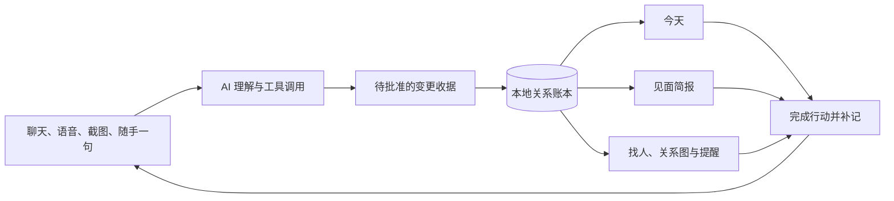

# 同届参赛项目横向调研与知脉改进启示

> 调研日期：2026-09-02
>
> 调研对象：8 个公开 GitHub 仓库（对应 7 套产品）
> 目的：从同届作品的产品定位、载体与分发、持续使用、首次体验、文档展示、Agent harness、数据结构、交互、部署和比赛表达中提炼可验证的经验，为知脉 Connect 后续改进提供依据。

## 一、结论先行

八个仓库展示了七种很不一样的产品路线：行业调查大屏、长期学习工作台、证据验证 CLI、Android 旅行伴侣、附近推荐 H5、可嵌入第三方平台的工程 Copilot，以及可反复编辑的辩论工作台。它们说明，Agent 的竞争力同时来自三件事：用户愿意反复打开的产品形态、能够进入现有生活入口的分发方式，以及支撑长期任务的运行制度。

本轮调研得到十二项核心结论。

1. **最强的作品都围绕一个清楚的领域闭环组织产品。** AquaDetective 是“发现异常—提出假设—核验证据—形成报告”，TravelAgent 是“规划—监测—重规划—批准行动”，Debate-Spark 是“准备—对练—复盘—策略比较”。用户可以理解任务怎样开始、怎样推进、最后留下什么成果。
2. **产品载体决定 Agent 能否进入日常生活。** TravelAgent-Front 用 Capacitor、Android 本地通知和移动时间线承接旅行中的持续变化；nearby-go 用打开即用的 H5 和一个输入框降低首次体验门槛。知脉适合发展成 Web/PWA 主产品、Android 移动伴侣和轻量第三方入口，而不应长期停留在必须守着桌面标签页的网页。
3. **“今天要做什么”比“系统有哪些模块”更能产生回访。** Next-Tutor-Agent 用今日任务、周计划、记忆和学习总览形成长期工作空间；TravelAgent 用通知和时间线把用户带回未完成事项。知脉需要一个“今天”首页，汇总待确认提案、临近生日、未兑现承诺、待回访人物和一键补记。
4. **可编辑产物让 AI 结果拥有生命周期。** Debate-Spark 的论证图、证据卡、稿件版本和辩论回合，Isaac 的报告、代码、结构化结果和图表，都能被继续使用。知脉可以把见面简报、关系分析、引荐方案和行动计划保存为可重算、可比较的工作台产物。
5. **同一个领域核心可以有多个入口。** Isaac Lab RL Co-pilot 同时提供 Skill、Python 和 OpenAI 兼容 HTTP Agent，并明确面向清小搭等平台接入。知脉可保留完整 Web 工作台，同时逐步提供 PWA、移动分享入口、只读 Skill/MCP 和平台 Agent；所有入口仍调用同一套检索、提案与账本能力。
6. **登录的价值在于连续性。** Next-Tutor-Agent 已提供游客模式、注册登录、账号隔离和工作区。知脉可以保留免登录本地模式，再提供可选账号、设备管理、加密同步和授权撤销；登录时机应出现在用户需要备份或跨设备继续时。
7. **README 本身就是产品界面。** Debate-Spark 用品牌名、使用场景、主要产物和逐步指南建立理解；AquaDetective 用三条固定故事线和验证数字帮助评委复现；VeriOI 与 Next-Tutor-Agent 提供英文入口；Isaac 用 Mermaid、真实产物图和多种 Quick Start 面向不同读者。知脉现有 README 的品牌、边界和在线入口较完整，仍缺首屏真实截图或短 GIF、独立英文版、三分钟体验路径和带图的产物画廊。
8. **Agent 数量不代表产品深度。** 角色名称有助于讲清职责，用户最终感知的是任务状态、工具结果、产物、批准和后续行动。知脉应继续用“个人关系秘书”统领体验，把复杂编排留在后台。
9. **模型与确定性程序的分工是共同基础。** AquaDetective 把数值和拓扑交给纯函数，Isaac 把 AST 校验和日志分析交给工具，VeriOI 把结论绑定到分级证据。知脉“理解归模型，事实归账本，批准归人”的方向成立，需要贯穿所有入口。
10. **长任务需要成为可持久化业务对象。** Debate-Spark 的辩论回合与工作台版本进入 SQLite，Next-Tutor-Agent 把学习任务和记忆生命周期显式化。知脉的聊天、工具记忆和暂停检查点也应像人物档案一样可保存、恢复和继续。
11. **可复现演示和量化评测能把技术变成可信展示。** AquaDetective 的固定 seed、离线回放和批量指标，VeriOI 的 mutant 与证据等级，都让观众能够理解系统做成了什么。知脉适合建立固定人物库、可回放任务和一组产品指标，同时展示移动提醒、工作台和跨入口连续性。
12. **知脉当前有两条同等重要的升级主线。** 产品侧需要日常首页、移动入口、场景化产物、账号连续性和更强的仓库门面；工程侧需要持久 run、统一工具契约、语义引用解析和可重放评测。模型预算只能改善单次发挥，无法代替这两条主线。

如果只做一轮初评阶段升级，建议并行完成五件事：

- 增加“今天”首页和“见面简报”，让人物档案自然进入提醒与行动；
- 为 README 增加真实截图或 15 秒产品 GIF、三分钟体验路径和 `README.en.md`；
- 把现有网页完善成可安装 PWA，并验证手机快速录入、分享材料和通知深链接；
- 做一个使用合成档案的 OpenAI 兼容平台演示入口，核对清小搭接入条件；
- 持久化 Agent run、工具观察和未批准提案，使切页、刷新和上游故障不再丢失工作。

## 二、调研方法与证据边界

### 2.1 调研材料

八个项目的实现判断只采用公开仓库中的一手材料：

- 根目录 README 与项目文档；
- 默认分支源码、配置和依赖；
- 测试、CI、演示脚本与仓库内评测产物；
- 提交记录、release 或 APK 等仓库交付物。

“清小搭”用于讨论校园入口和第三方 Agent 生态，不纳入八仓实现矩阵。相关判断只引用清华大学官方页面、校内官方报道和教育部报道；这些资料能够说明产品入口与生态方向，不能代替具体接入协议、开发者权限和数据授权条件。知脉若开展接入，仍需向平台方核对开放范围。

没有把宣传页面、二手报道、星标数量或模型生成的项目摘要当成实现证据。以下三类表述严格分开：

| 标记 | 含义 | 本报告的处理方式 |
| --- | --- | --- |
| 文档声明 | README 或设计文档声称具备 | 写明“项目报告/文档声明”，不自动视为独立验证 |
| 源码确认 | 能在实现、schema、接口或测试中定位 | 可用于判断机制与边界 |
| 分析判断 | 基于公开实现推导出的优势、风险或适配性 | 明确写成调研结论，不冒充项目作者原意 |

本轮没有独立部署七套产品系统，也没有使用它们的真实模型密钥或外部服务重跑全部测试。仓库内的测试数量和评测结果因此属于“可定位的项目自报结果”。报告会继续判断其评测设计能证明什么、不能证明什么。

### 2.2 固定快照

仓库在调研期间仍可能变化。下表记录本轮使用的默认分支 HEAD；正文优先提供固定提交或具体源码链接。

| 项目 | 领域与形态 | 默认分支 HEAD | 公开实现概貌 |
| --- | --- | --- | --- |
| [AquaDetective](https://github.com/Jesse-dry/AquaDetective) | 水质预警与污染溯源 Web 系统 | [`116598a`](https://github.com/Jesse-dry/AquaDetective/commit/116598a5ec1e718ff99ff64190536bf09bdd83ca) | LangGraph 固定调查流程、确定性计算、可回放大屏 |
| [Next-Tutor-Agent](https://github.com/invincible-summer/Next-Tutor-Agent) | 长期学习工作台 | [`bf2f334`](https://github.com/invincible-summer/Next-Tutor-Agent/commit/bf2f3347414116447a1a9f4d854aa59395d0b2ba) | Supervisor、技能注册、检索、学习状态与多模块 UI |
| [VeriOI](https://github.com/YanfengWo/VeriOI) | OI 参考解验证 CLI | [`63140cc`](https://github.com/YanfengWo/VeriOI/commit/63140cc4f184d3c7fcbba585eae91d01b55fa137) | A0–A6 证据阶梯、oracle、mutant、形式化验证 |
| [TravelAgent-Front](https://github.com/XuZhiYaoTsinghua/TravelAgent-Front) | 旅行 Agent 移动端 | [`36ba573`](https://github.com/XuZhiYaoTsinghua/TravelAgent-Front/commit/36ba573249f8a476a7fb08e9a84cc8d82ff19177) | React、Capacitor、时间线、地图、行动确认 |
| [TravelAgent](https://github.com/Danieltoraji/TravelAgent) | 旅行规划、监测与执行后端 | [`c2c4e68`](https://github.com/Danieltoraji/TravelAgent/commit/c2c4e68c6f1a96df1d16c8d0fd9b5d82d12cd4bc) | 类型化契约、监测、重规划、Action Queue |
| [nearby-go](https://github.com/wssg1118/nearby-go) | 附近吃喝玩乐推荐 H5 | [`7f9bfcf`](https://github.com/wssg1118/nearby-go/commit/7f9bfcf60ed80179c451ef4c905d4b3976487b87) | Dify Chatflow、地图工具、短会话与隐私边界 |
| [Isaac Lab RL Co-pilot](https://github.com/thu25li/isaac-lab-rl-copilot-release) | 机器人强化学习垂直 Copilot | [`d280229`](https://github.com/thu25li/isaac-lab-rl-copilot-release/commit/d2802294074c6881015eced9d60c50dae140c803) | 统一确定性工具核心、Skill 与 HTTP Agent 双形态 |
| [Debate-Spark](https://github.com/Kyle-Yu16/Debate-Spark) | 中文辩论准备与对练工作台 | [`eeb42d6`](https://github.com/Kyle-Yu16/Debate-Spark/commit/eeb42d6a59aef6f2a2ae82882584c7f3edb85b30) | SQLite 工作台、回合恢复、证据卡与竞技场 |

短 SHA 只用于阅读；链接指向本轮定位到的提交。AquaDetective 的 HEAD 是定时数据归档提交，不能据此推断产品代码当天发生了变化。

TravelAgent-Front 与 Danieltoraji/TravelAgent 是同一套旅行产品的 C 端和后端/规划执行仓库，接口路径、README 分工和生产 API 配置可以相互对应。因此，本轮覆盖的是八个仓库、七套产品；横向分析仍分别讨论前端交付与后端 harness。

### 2.3 比较维度

本报告没有给项目打总分。项目面对的问题不同，强行排名会掩盖它们各自的设计价值。横向比较采用以下维度：

1. 用户问题和核心闭环是否清楚；
2. 第一次使用的入口是否轻，用户为何会再次打开；
3. Web、移动端、CLI、Skill 和平台接入等产品载体如何分工；
4. 登录、游客模式、长期状态和多设备连续性如何处理；
5. 结果是否成为可编辑、可导出、可继续使用的产物；
6. README、截图、架构图和演示叙事是否帮助用户真正上手；
7. Agent loop 是真实的状态执行，还是角色化的单次提示；
8. 工具、权限、预算和错误恢复是否统一；
9. 数据、记忆、run 和中间产物是否持久化；
10. 模型与确定性代码的边界是否合理；
11. 证据、引用、置信度和适用范围是否可追溯；
12. 用户能否理解、修改、批准、撤销和继续任务；
13. 自动化测试与评测能否证明关键能力；
14. 部署、密钥、隐私和多用户边界是否清楚；
15. 比赛叙事与源码实现是否一致。

## 三、八个仓库、七套产品系统的类型地图

七套产品系统可以分成四类。这个分类比“单 Agent / 多 Agent”更能解释它们的差异。

### 3.1 确定性领域引擎外包给模型编排

AquaDetective、VeriOI 和 Isaac Lab RL Co-pilot 都把难以可靠生成的计算或校验放进确定性模块。AquaDetective 计算水流拓扑、传播和指纹；VeriOI 编译、差分、变异、模型检查和证明；Isaac 项目做 AST 校验、日志诊断和参数建议。模型负责意图、组合和解释。

这类作品最接近知脉的“模型理解、账本执行”哲学。可迁移的核心是职责边界；固定阈值和领域词典只适用于各自原场景。

### 3.2 长期状态与用户工作台

Next-Tutor-Agent 和 Debate-Spark 把一次问答扩展成长期工作空间。它们保存学习进度、计划、证据、工作台版本、对练回合或策略记录。用户返回后可以沿着此前形成的结构继续工作；聊天只是其中一条记录。

这类作品直接揭示了知脉目前的缺口：人物档案已经持久，Agent 的工作过程却没有成为同等地位的数据。

### 3.3 现实世界行动循环

TravelAgent 前后端把路线规划之外的监测、突发事件、重规划、用户批准和行动执行串起来。它关心任务完成后的世界变化，是“持续代理”而非一次答案。

知脉的事件、提醒、任务和关系推荐可以形成类似循环：记录承诺或事件 → 生成提醒 → 到期建议行动 → 用户执行或调整 → 形成新的互动记录。

### 3.4 小而聚焦的情境助手

nearby-go 把范围控制在“基于当前位置找吃喝玩乐”，并明确哪些信息来自地图、哪些只是建议、哪些事实暂不提供。这种克制对比赛和产品都很有效。知脉能力更广，每个入口仍应让用户一眼看懂当前任务，完整架构和高级选项留到需要时再展开。

## 四、产品形态、入口与展示风格

### 4.1 用户怎样进入、为什么回来、最后带走什么

把七套产品放在用户旅程里看，差异比 Agent 数量更明显。

| 产品 | 第一次进入 | 反复打开的理由 | 用户带走的产物 | 账号与载体 | 给知脉的启示 |
| --- | --- | --- | --- | --- | --- |
| AquaDetective | 一键启动预置污染事件 | 监测、调查和回放下一次事件 | 调查报告、证据轨迹、指标 | Web 大屏，无个人账号 | 用固定故事和重置按钮让复杂能力可试玩 |
| Next-Tutor-Agent | 游客体验或注册登录，再提问/上传材料 | 今日任务、周计划、错题、记忆复习 | 学习计划、笔记、进度和长期画像 | Web 工作台，有登录 | “今天”页面和长期进度比模块菜单更能形成回访 |
| VeriOI | 安装 CLI，执行 doctor/list/check | 每次题解或 CI 都需要验证 | 分级验证报告、反例、证明结果 | CLI、CI，无个人账号 | 简短双语文档和证据阶梯能快速建立专业感 |
| TravelAgent | 填写行程后进入时间线 | 行程变化、提醒和待批准行动 | 路线、时间线、行动记录 | Web + Capacitor Android，无成熟账号 | 手机通知、深链接和持续任务使 Agent 进入现实过程 |
| nearby-go | 首页一个输入框和四个例句 | 吃饭、咖啡、周末活动等高频小任务 | 当次推荐和导航链接 | H5、本地随机会话 | 首屏只承接一个任务，结构化选项按需展开 |
| Isaac Lab RL Co-pilot | Python、Skill 或 HTTP 三类入口 | 每次训练诊断、改参与实验都能复用 | Markdown 报告、代码、JSON、图表 | 本地工具 + 平台 Agent | 一个领域核心可以服务完整工作台和第三方轻入口 |
| Debate-Spark | 创建辩题项目，进入工作台 | 补证据、改稿、对练、复盘 | 证据卡、论证图、版本、回合记录 | 本地 Web、SQLite | AI 输出应成为能修改、比较和继续使用的工作对象 |

这张表说明知脉还缺少两层产品表达：第一层是“今天为什么打开”，第二层是“这次整理之后留下了什么”。人物库和关系图是底层资产；用户日常感知到的应当是见面前的一页简报、到期承诺、待确认的变更、可继续的分析和已经完成的互动记录。

### 4.2 从“功能导航”走向“个人关系工作台”

Next-Tutor-Agent 的今日任务和学习总览、Debate-Spark 的项目工作台、TravelAgent 的时间线都在回答同一个问题：用户下一步做什么。知脉可以把默认入口组织成“今天”，同时保留人物关系页作为深入查看入口。

“今天”首页建议包含五块：

1. **今天要处理**：生日、承诺、待回访、待办和即将发生的事件；
2. **继续上次工作**：尚未完成的 Agent run、已取得的工具结果和待批准提案；
3. **见谁之前**：按日历或用户选择生成见面简报；
4. **刚刚发生**：一句话、语音、截图或分享文本快速补记；
5. **本周关系变化**：新增人物、久未联系、未完成承诺和需要核对的信息。

长期闭环可以写成：

```text
发生一件事 → 随手记下 → 形成待确认档案
     ↓                         ↓
下次见面前 ← 见面简报 ← 人物、关系、事件与承诺
     ↓
完成行动 → 记录结果 → 更新关系记忆与后续提醒
```

工作台还可以保存“关系侦探报告”“引荐方案”“沟通演练”“关系周报”等产物。它们通过稳定 ID 引用档案，源事实变化时标记为待重算；用户可以查看旧版本，理解结论为何改变。

### 4.3 Android 与移动端：先把录入和提醒带进生活现场

TravelAgent-Front 已用 Capacitor 把 React Web 封装为 Android 应用，并接入 Haptics 和 Local Notifications；Android 配置申请了通知、精确定时、振动和开机广播等权限。[Capacitor 配置](https://github.com/XuZhiYaoTsinghua/TravelAgent-Front/blob/36ba573249f8a476a7fb08e9a84cc8d82ff19177/capacitor.config.ts)、[依赖清单](https://github.com/XuZhiYaoTsinghua/TravelAgent-Front/blob/36ba573249f8a476a7fb08e9a84cc8d82ff19177/package.json)、[AndroidManifest](https://github.com/XuZhiYaoTsinghua/TravelAgent-Front/blob/36ba573249f8a476a7fb08e9a84cc8d82ff19177/android/app/src/main/AndroidManifest.xml)

知脉适合先把现有 React 应用完善为可安装 PWA，验证移动使用频率，再决定 Capacitor 封装。第一版移动伴侣应围绕低摩擦入口设计：

- 从微信、短信、浏览器、相册和文件管理器“分享到知脉”；
- 锁屏或桌面快捷入口，一句话、录音或拍照就能记下刚发生的事；
- 本地通知提醒生日、承诺、回访和待批准提案，点击直达人物或事件；
- 离线时先写入本地 outbox，恢复网络后再执行需要模型的整理；
- 主页小组件只显示最少必要信息，敏感姓名和正文由用户选择是否出现；
- 后续再接系统日历、通讯录和地图深链接，并保留来源与授权范围。

移动端的核心指标应是“从生活材料到可确认提案用了几步”，而非 APK 是否成功打包。PWA 和 Android 共用同一领域核心、归档格式、proposal 与 run 状态，避免出现两套人物库。

### 4.4 登录与多设备：在用户需要连续性时出现

Next-Tutor-Agent 提供游客模式、注册登录和账号工作区，说明账号可以服务长期进度，而无需成为首次体验门槛。[项目 README](https://github.com/invincible-summer/Next-Tutor-Agent/blob/bf2f3347414116447a1a9f4d854aa59395d0b2ba/README.md) 其它被调研的 Web 项目大多仍是单机或本地随机会话，这也是参赛原型常见的断点。

知脉的合理路径是：

1. 初次打开继续使用免登录本地库；
2. 当用户点击“备份”“换设备继续”或“安装手机端”时，解释账号带来的具体价值；
3. 账号只建立身份、设备和同步授权，本地数据库仍可独立工作；
4. 每台设备维护稳定设备 ID、同步 outbox、版本和冲突状态；
5. 提供设备列表、远程撤销、导出恢复和删除云端副本；
6. 加密同步、用户自选云存储或端到端加密作为隐私要求更高的方案。

这条路线的产品重点是连续性：用户从电脑整理完一段材料，手机能收到同一事件的提醒；在手机补记会面后，电脑上的人物时间线出现可理解的变更记录。账号页应展示“哪些数据位于本机、哪些已同步、最后一次同步时间、是否存在冲突”。

### 4.5 “清小搭”与校园 Agent 入口

清华官方资料显示，清小搭通过网页和微信小程序触达用户，提供模型问答、提醒日历、个人成长云盘和智能体广场等能力。[清华大学学习与发展指导中心介绍](https://learning.tsinghua.edu.cn/xxyfzxm/aitown/qxd.htm)、[清华校报报道](https://qhbk.tsinghua.edu.cn/xqh/2025-04/18/content_99184335.html)、[清华大学上线报道](https://www.tsinghua.edu.cn/info/1176/114345.htm) 教育部 2026 年报道还提到通过 MCP 连接校园服务入口、动态成长档案和智能体广场。[教育部报道](https://www.moe.gov.cn/s78/A12/gongzuo/moe_2154/202604/t20260427_1434908.html)

Isaac Lab RL Co-pilot 的官方仓库已经把 OpenAI 兼容 HTTP Agent 写成可接入清小搭的入口，并给出附件、SSE、模式卡和开场提示等交付线索。[Isaac README](https://github.com/thu25li/isaac-lab-rl-copilot-release/blob/d2802294074c6881015eced9d60c50dae140c803/README.md) 这证明“主产品 + 平台 Agent”是一种现实的作品形态，但知脉能获得哪些接口、身份和数据权限仍取决于平台方。

知脉可以分三层推进：

- **比赛演示 Agent**：只使用合成人物库，开放“记住一个人”“这事找谁”“见面前提醒我什么”三类任务，完整展示来源和提案；
- **知脉校园版**：经统一身份和用户授权，连接课表、活动、校园目录、项目与社团信息，服务导师联系、团队协作、活动回访和比赛承诺；
- **个人平台入口**：平台负责轻量问答和触发任务，完整档案仍由知脉主产品管理；涉及写入时回到主产品展示变更收据并批准。

校园目录、课程和活动属于外部来源，不能直接覆盖用户私人备注。平台入口只取得当前任务需要的最小范围，授权可以撤销。正式开发前应先拿到接入文档，做一个不含私人数据的协议探针，核对鉴权、附件、流式输出、会话身份和回调能力。

### 4.6 README 是用户、评委和智能体共同看到的产品首页

八个仓库的 README 各有值得吸收的做法，也存在明显空位。

| 项目 | README 最有效的做法 | 仍可改进之处 |
| --- | --- | --- |
| AquaDetective | 产品故事、三条预置事件、一键启动、固定指标和真实边界连成一条复现路线 | 缺产品截图、GIF 和英文入口，后半部信息密度高 |
| Next-Tutor-Agent | 同时照顾产品、架构、模块和长期路线，提供中英文内容 | 中英文塞在一份长文档，工程里程碑压过了首次体验 |
| VeriOI | 英文主 README + 独立中文文档；名称解释、证据阶梯和命令都很清楚 | CLI 过程缺一段终端 GIF 或示例报告前后对照 |
| TravelAgent | 后端 README 的生命周期定位、角色表和 Mermaid 架构清楚 | 前后端文档分散，缺真实 UI、英文入口和当前状态核对 |
| nearby-go | 首段就说清价值、数据来源和隐私边界，安装说明克制 | 缺截图、架构图、英语摘要和连续使用故事 |
| Isaac | 一句话输入/输出、多入口 Mermaid、模式表、真实 PNG 产物和多种 Quick Start | 篇幅长、重复内容多，完整产品界面不足 |
| Debate-Spark | 品牌、三种模式、产物和逐点击指南构成真实上手路径 | 缺 UI 动图、英文入口和部署后的试玩链接 |

固定证据可见各项目 [AquaDetective README](https://github.com/Jesse-dry/AquaDetective/blob/116598a5ec1e718ff99ff64190536bf09bdd83ca/README.md)、[Next-Tutor-Agent README](https://github.com/invincible-summer/Next-Tutor-Agent/blob/bf2f3347414116447a1a9f4d854aa59395d0b2ba/README.md)、[VeriOI README](https://github.com/YanfengWo/VeriOI/blob/63140cc4f184d3c7fcbba585eae91d01b55fa137/README.md)、[TravelAgent README](https://github.com/Danieltoraji/TravelAgent/blob/c2c4e68c6f1a96df1d16c8d0fd9b5d82d12cd4bc/README.md)、[nearby-go README](https://github.com/wssg1118/nearby-go/blob/7f9bfcf60ed80179c451ef4c905d4b3976487b87/README.md)、[Isaac README](https://github.com/thu25li/isaac-lab-rl-copilot-release/blob/d2802294074c6881015eced9d60c50dae140c803/README.md) 和 [Debate-Spark README](https://github.com/Kyle-Yu16/Debate-Spark/blob/eeb42d6a59aef6f2a2ae82882584c7f3edb85b30/README.md)。

知脉现有 README 已经具备品牌定位、在线入口、能力边界、隐私说明和开发命令。下一版最值得重构成以下阅读顺序：

1. Logo、产品名、一句话承诺、在线体验和中文/English 入口；
2. 15–30 秒真实产品 GIF，完整出现“粘贴材料—提案—批准—人物/事件可见”；
3. 三张结果卡：见面简报、关系路径、提醒/承诺；
4. “三分钟体验”按钮：演示库、空库和真实材料三条路线；
5. 一张产品流程图和三张带注释截图；
6. “已经实现 / 当前限制 / 下一步”三列，避免把路线图写成现有能力；
7. 架构、数据契约、Agent harness 和隐私边界的深入链接；
8. 最短本地运行、测试和部署验证命令；
9. 独立 `README.en.md`，中文与英文互相链接。

根 README 的主图可以直接解释产品闭环：



技术图放在下一屏或架构文档中，画出同一 ToolSpec 如何服务录入、问答、推荐和平台入口，以及事实账本、执行账本、projection、IndexedDB 的边界。产品图解释“为什么用”，技术图解释“怎样成立”，不要把所有模块挤进一张图。

指导文案按真实动作写：先让用户粘贴一句话，随后告诉他应看到几条提案、批准后到哪里查看、下一句可以问什么。每一步都配预期结果和失败时保留的内容。英文版沿用同一信息结构，重新写自然的英文产品文案和术语表，不把中文长文逐段直译。

根 README 控制在首次访问者能顺读完的长度。详细 schema、测试数字和历史报告继续留在 `doc/`；GitHub 首屏优先回答“它解决什么、我能看到什么、怎样立即试”。评委、用户和用于审阅仓库的智能体都会因此更容易建立正确模型。

### 4.7 品牌和展示：把抽象架构变成可记住的动作

VeriOI 用证据阶梯建立专业记忆点，Debate-Spark 用“发散—核验—收敛—压缩”组织操作，AquaDetective 用侦探故事把后台流程变成画面。知脉可以用四个动作统领产品展示：

```text
记下 → 理清 → 用上 → 记住变化
```

- **记下**：聊天、印象、语音、图片和临时一句话进入草稿；
- **理清**：人物、关系、事件、提醒与来源成为一张可确认收据；
- **用上**：见面简报、找人引荐、沟通演练和行动提醒；
- **记住变化**：事实修改、投影更新、互动回写和跨设备继续。

名称和 Logo 也应出现在 README、启动页和比赛材料首屏：“知”取知了，“脉”取人脉；Logo 是知了的脉翅，翅脉交汇形成关系图节点。它把自然记忆、关系网络和产品识别统一成一个视觉符号。架构图负责解释机制，产品 GIF 负责让人看见价值，两者各承担一种理解任务。

### 4.8 产品机会优先级

| 机会 | 用户价值 | 初评展示价值 | 关键依赖 | 建议阶段 |
| --- | --- | --- | --- | --- |
| README 真实 GIF、截图与英文版 | 降低理解和安装成本 | 极高，仓库首屏即可验证 | 稳定演示数据 | P0 |
| “今天”首页 | 形成日常回访入口 | 高，能说明产品不是一次性录入器 | 事件、提醒、run 汇总 | P0 |
| 场景包和一键演示库 | 新手无需先搭人物库 | 极高，评委可立即试玩 | 合成档案、重置 | P0 |
| 见面简报与关系工作台 | 把档案转成可使用产物 | 极高，个人秘书定位清楚 | 事件/关系投影、导出 | P0–P1 |
| PWA、移动分享和通知深链接 | 在生活现场快速记录并及时行动 | 中高 | manifest、service worker、run 持久化 | P1 |
| 清小搭合成数据 Agent | 获得校园分发和比赛生态入口 | 高 | 正式接入文档、平台审核 | P1 |
| 可选账号和同步 | 换设备后继续工作 | 中，利于落地叙事 | 身份、加密、同步与冲突模型 | P2 |
| Capacitor Android | 更完整的分享、通知和系统集成 | 中高 | PWA 行为验证、移动 QA | P2 |
| 校园/企业连接器与共享空间 | 扩大场景和协作能力 | 中长期 | OAuth/统一身份、细粒度授权 | P3 |

产品路线和 harness 路线应同步推进。只做移动外壳会把当前会话丢失带到手机；只做运行恢复也无法回答用户为什么每天打开。P0 需要同时交付一个可感知的新入口和一项支撑连续性的底层能力。

## 五、横向比较矩阵

下表用于快速定位强项和缺口。“强/中/弱”只描述该项目在本轮公开仓库中呈现的相对完整度。

| 项目 | 领域闭环 | 真实 Agent loop | 持久 run/恢复 | 证据与来源 | 人工批准/编辑 | 自动评测 | 部署成熟度 | 最值得学习 |
| --- | --- | --- | --- | --- | --- | --- | --- | --- |
| AquaDetective | 强 | 中：固定图+可选 LLM 重排 | 中：可回放，不能节点续跑 | 强：证据流、真值隔离 | 弱 | 强：seed+批量指标 | 中低 | 可复现演示与诚实边界 |
| Next-Tutor-Agent | 强 | 强但复杂 | 中强：会话与 job 持久；逐工具续跑未证实 | 强：检索状态与证据层级 | 强 | 强：大量模块测试 | 中 | 长期状态与上下文制度 |
| VeriOI | 强 | 不适用：验证流水线 | 强：报告可复现 | 极强：A0–A6 | 强：A5 人审 | 强：oracle+mutant+形式化 | 中 | 声明强度绑定证据等级 |
| TravelAgent-Front | 中强 | 依赖后端 | 中：本地 session | 中 | 强：行动批准/拒绝 | 弱 | 中：有 APK | 移动交付和时间线交互 |
| TravelAgent | 强 | 中强：监测—决策—重规划 | 中 | 中强：事件与 action 契约 | 强：权限分级 | 中强 | 中 | 行动队列和持续监测 |
| nearby-go | 强且聚焦 | 中：Dify 工作流 | 弱：短历史 | 中：数据源边界清楚 | 弱 | 中低 | 中 | 范围克制与隐私说明 |
| Isaac Lab RL Co-pilot | 强 | 中：统一薄 loop | 弱：无持久 run | 强：资源附 sources/pitfalls | 弱 | 强：模块测试 | 中低 | 一套核心、多种外壳 |
| Debate-Spark | 强 | 弱到中：多为阶段化单次调用 | 强：SQLite 回合与快照 | 中：证据卡，取证较浅 | 强：编辑、锁定、版本 | 中 | 中低 | 可编辑中间态与跨刷新恢复 |

矩阵显示，任何一个项目都没有同时解决开放语义、复杂关系账本、长任务恢复、人工批准、隐私和多端同步。知脉无需模仿一份完整产品；更合理的做法是吸收不同项目中已经被源码证明有效的结构。

## 六、逐项目深度分析

### 6.1 AquaDetective：把调查过程变成可观看、可重放的证据故事

#### 产品闭环

AquaDetective 面向水环境管理场景，把任务压缩为一条很容易理解的“侦探故事”：监测异常、提出污染源假设、核验证据、锁定候选、匹配法规、形成处置建议和报告。项目预置夜间偷排、突发泄漏和渐变失效三条故事线；地图、断面趋势、假设排名和报告围绕同一事件推进。这个设计让领域复杂性成为演示内容，而没有先要求观众理解 Agent 架构。[项目 README](https://github.com/Jesse-dry/AquaDetective/blob/116598a5ec1e718ff99ff64190536bf09bdd83ca/README.md)

它最鲜明的原则是：超标判断、扩散浓度、指纹相似度、上下游关系等数值全部由 NumPy、SciPy、NetworkX 和领域函数计算，模型只能参与候选组织和语言表达。对知脉而言，对应的确定性部分是稳定 ID、关系断言、亲属投影、路径、排序、引用完整性和事务；“某段自由文本究竟表达了什么关系”仍应交给模型。

#### 源码中的 Agent 深度

README 用监测、调查、法规、处置、报告五个 Agent 讲故事。源码确实把它们接成 LangGraph 节点，但多数节点是固定函数或模板：监测节点扫描数据库，法规节点查询源码内静态列表，处置节点读取 `PLANS` 字典，报告节点拼接 Markdown。图本身是解析、假设、验证、结论、合规、响应、报告的固定状态机。[状态图](https://github.com/Jesse-dry/AquaDetective/blob/116598a5ec1e718ff99ff64190536bf09bdd83ca/backend/app/agents/graph.py)、[监测节点](https://github.com/Jesse-dry/AquaDetective/blob/116598a5ec1e718ff99ff64190536bf09bdd83ca/backend/app/agents/monitor.py)、[报告节点](https://github.com/Jesse-dry/AquaDetective/blob/116598a5ec1e718ff99ff64190536bf09bdd83ca/backend/app/agents/reporter.py)

真正使用模型的核心位置是 investigator：程序先依据上游拓扑和固定权重形成候选，模型最多对已有企业 ID 重新排序并写理由。模型不能创造数据库外的污染源，也不做数值计算。候选低于阈值时被排除，达到阈值或用完三轮时结束。[调查器](https://github.com/Jesse-dry/AquaDetective/blob/116598a5ec1e718ff99ff64190536bf09bdd83ca/backend/app/agents/investigator.py)

准确描述应是“多阶段确定性调查流程，调查阶段可选用 LLM 重排候选”。这个实现本身很合理；问题出在把固定阶段的角色名当成自主 Agent 数量。对知脉的直接提醒是：统一 runtime、真实工具选择、持久状态和恢复能力比角色名称更有技术含量。

#### 状态、回放与恢复

每次调查从新的 `AquaState` 开始，结束后保存 investigation 和 event 状态；消息流写为 JSONL、报告写为 Markdown，Replay 页面可以逐条回放。[运行器](https://github.com/Jesse-dry/AquaDetective/blob/116598a5ec1e718ff99ff64190536bf09bdd83ca/backend/app/agents/runner.py)、[记录器](https://github.com/Jesse-dry/AquaDetective/blob/116598a5ec1e718ff99ff64190536bf09bdd83ca/backend/app/agents/recorder.py)、[回放页](https://github.com/Jesse-dry/AquaDetective/blob/116598a5ec1e718ff99ff64190536bf09bdd83ca/frontend/src/pages/ReplayPage.tsx)

这里要区分两种能力：replay 能重现已经保存的表现过程，resume 能从失败节点继续执行。仓库未见 LangGraph checkpointer 或逐节点持久检查点，因此它具备前者，没有证明后者。知脉需要同时具备二者：评委可观看完整轨迹，用户遇到 503 或换页时也能从最后一个安全点继续。

#### 数据、评测与可信边界

SQLite 把河网节点、边、站点、企业、指纹、读数、事件和调查分开保存；模拟事件的 `truth_source` 不进入 Agent 可见的 observation，只在事后评测使用。这是很好的真值隔离。[数据库结构](https://github.com/Jesse-dry/AquaDetective/blob/116598a5ec1e718ff99ff64190536bf09bdd83ca/backend/app/db.py)

仓库报告 27 项后端测试、8 项前端测试，以及 30 次随机注入下的预警率、Top-1/Top-3、MRR 和传播时间误差；后端和前端都有 CI。[后端 CI](https://github.com/Jesse-dry/AquaDetective/blob/116598a5ec1e718ff99ff64190536bf09bdd83ca/.github/workflows/backend-ci.yml)、[前端 CI](https://github.com/Jesse-dry/AquaDetective/blob/116598a5ec1e718ff99ff64190536bf09bdd83ca/.github/workflows/frontend-ci.yml)

这些指标衡量的是同一套模拟世界中生成器、指纹和评分器的闭环一致性，不能证明跨真实流域泛化。项目在 README 中主动把真实数据案例降格为“候选命中”，并披露许可注销和代理指纹，这是值得学习的声明纪律。

#### 对知脉的取舍

可直接吸收：

- 固定 seed 的合成人物库和可重放 Agent 轨迹；
- 真值与 Agent 可见材料隔离；
- 用“候选—支持证据—反对证据—排名变化”解释推荐；
- 真实 API 失败时可运行的明确标注离线演示；
- 自动指标与真实案例分栏展示。

需改造后吸收：

- 关系路径和亲属投影可以确定性计算，开放生活语义不能套固定权重；
- 角色化 UI 可以帮助叙事，但必须显示本轮是否真的调用模型；
- 回放记录要和 durable checkpoint 共存。

不应照搬：

- 把模板阶段计为多个自主 Agent；
- 模型异常静默回退，界面仍呈现正常推理；
- 用固定三轮和固定阈值封闭开放语义；
- 以合成准确率暗示真实人物关系判断准确率。

### 6.2 Next-Tutor-Agent：最完整的长期 harness，也是一份复杂度警示

#### 产品与用户生命周期

Next-Tutor-Agent 将 AI 家教组织为长期工作台：用户提出目标，系统理解任务、检索材料、讲解、练习、评估，再更新掌握度、偏好、记忆、计划、笔记和洞察。公开页面覆盖聊天、仪表盘、知识图谱、学习计划、测评、记忆、资源、笔记和个人设置。[项目 README](https://github.com/invincible-summer/Next-Tutor-Agent/blob/bf2f3347414116447a1a9f4d854aa59395d0b2ba/README.md)

它说明一件重要的产品事实：长期助理的“记忆”不能只是一串聊天。计划、材料、测评、用户状态、任务和版本需要成为各自可管理的对象。知脉的人物档案已经做到这一点，Agent run 和工作记忆仍需补齐。

#### Supervisor、状态与工具循环

项目使用类型化的 `TaskUnderstanding`、`PlanStep`、`TaskPlan` 和 `TaskState`；Supervisor 依次完成任务理解、学习者快照、技能选择、计划和门控、上下文构造、ReAct 执行、持久化与 hooks。[状态类型](https://github.com/invincible-summer/Next-Tutor-Agent/blob/bf2f3347414116447a1a9f4d854aa59395d0b2ba/backend/app/agents/state.py)、[设计文档](https://github.com/invincible-summer/Next-Tutor-Agent/blob/bf2f3347414116447a1a9f4d854aa59395d0b2ba/docs/DESIGN.md)

executor 默认最多六步，包含参数校验、重复调用检测、连续失败熔断、长结果落盘、恢复提示、技能后置条件和多种工具协议兼容。[executor](https://github.com/invincible-summer/Next-Tutor-Agent/blob/bf2f3347414116447a1a9f4d854aa59395d0b2ba/backend/app/agents/executor.py) 这比知脉当前每个入口各自管理部分状态更接近统一 harness。

代价也很明显：Supervisor v2 与 legacy fallback 并存，native tool call 与旧消息协议并存，技能和模块拥有大量开关、gate、hook 和 fail-open 分支，executor 又为预检索、伪工具、空答案和重复调用累积特例。此时“系统有没有回答”不再等于“预期模块确实运行”。如果轨迹不能标明走了哪条路径，复杂的兜底会遮住真实失败。

这正对应知脉的教训：统一 runtime 的目标是减少执行路径，不能把多个旧执行器包在一层接口后继续共存。

#### 上下文、记忆与任务恢复

该项目把 session working set 与 append-only transcript 分开：session JSON 保存可继续工作的压缩状态，JSONL transcript 留下完整事实记录，历史压缩不会删除原始回合。上下文预算同时计算 system prompt、工具 schema、messages 和输出余量。[会话模型](https://github.com/invincible-summer/Next-Tutor-Agent/blob/bf2f3347414116447a1a9f4d854aa59395d0b2ba/backend/app/core/session.py)

教材 OCR 和建库任务采用逐页持久化、retry 状态、重启恢复、陈旧任务回收和受限队列。普通 ReAct 回合是否能在任意工具步骤精确续跑没有同样明确的保证；从持久化边界看，它更可能在完整轮次结束后保存，而非每个副作用步骤都具备幂等 checkpoint。

对知脉可直接转化为两层记录：

- `agentRuns` 保存面向恢复的当前状态；
- append-only `agentRunSteps` 保存完整输入摘要、工具观察、提案和错误。

压缩只改变下轮送给模型的工作集，不删除可恢复的原始步骤。

#### 人在回路与可撤销改进

Next-Tutor-Agent 的教学策略采用 observer → diagnose → propose → approve → deploy；提案、应用和撤销都有状态、接口与影响范围。这个模式比一个临时“接受”按钮更完整：提案本身是一等记录，批准才改变后续行为，撤销会停止消费旧策略。

知脉可以把相同结构用于批量圈层整理、关系清洗和用户偏好学习：模型提出规则或变更集，本地显示影响人数与冲突，用户批准后形成事务，策略和数据变更都可撤销。

#### 数据与工程代价

项目使用按用户和会话分目录的 JSON、JSONL、Markdown 和资源文件，配合锁与原子写。它便于单机阅读和备份，却难以保证跨文件事务。设计中甚至需要在保存会话前从磁盘合并测验结果，以避免不同写入者互相覆盖。这是文件式多真相开始膨胀的信号。

README 报告 1400+ 后端测试，仓库测试树很大；本轮没有在根目录定位到自动执行这些测试的 GitHub Actions，因此不能把测试数量直接等同于每次提交都通过的 CI。设计文档也出现工具数量、旧路径与现行实现不一致，说明广阔功能面已经产生文档债。

#### 对知脉的取舍

可直接吸收：

- working set 与追加式原始记录分离；
- 上下文预算覆盖提示词、工具 schema 和工具结果；
- 类型化 TaskState 与跨轮状态；
- 任务 checkpoint、陈旧任务回收和恢复；
- proposal → approve → apply → revoke；
- 用户身份解析、物理隔离和删除清理；
- 原始材料为事实源，摘要、索引和图谱可重建。

需改造后吸收：

- 只引入少量明确状态，不复制十层模块和开关；
- fallback 必须进入运行轨迹；
- 如果未来跨设备，采用事务账本或服务端数据库，避免多文件相互覆盖；
- 高级设置只暴露用户能真正决策的 provider、预算、保留期和授权。

不应照搬：

- v2/legacy 长期双轨；
- native/legacy 两套工具协议；
- 每个模块独立 fail-open；
- 关键词承担开放语义路由；
- 原始 `reasoning_content` 直接展示；
- 把内部架构开关铺给普通用户。

### 6.3 VeriOI：把“系统说对了”拆成可验证的证据等级

#### 为什么它仍值得纳入 Agent 调研

VeriOI 是验证算法题参考解的确定性 CLI，运行时不调用大模型，也没有对话、模型 provider 或工具循环。它的价值在于回答一个更基础的问题：系统凭什么声称某项结论可靠？[项目 README](https://github.com/YanfengWo/VeriOI/blob/63140cc4f184d3c7fcbba585eae91d01b55fa137/README.md)

项目为每道题准备 manifest、候选实现、独立 oracle、确定性 generator、mutants、samples、CBMC 配置和 Why3 证明，并建立 A0–A6 阶梯：可构建、样例、差分、变异、有限模型检查、人工不变量审阅、机器演绎证明。在线评测 AC 被单独记录，不和形式证据混为一个“正确”标签。[assurance levels](https://github.com/YanfengWo/VeriOI/blob/63140cc4f184d3c7fcbba585eae91d01b55fa137/docs/assurance-levels.md)

#### 声明、适用范围与可信基

`Problem` 模型显式保存 claim、domain、assumptions、trusted components 和 exclusions；runner 记录编译、差分、mutant、模型检查、证明、源码 hash 和工具链。发布级 A6 还约束容器 digest、网络、验证条件、A5 审阅祖先与工作树状态。[领域模型](https://github.com/YanfengWo/VeriOI/blob/63140cc4f184d3c7fcbba585eae91d01b55fa137/src/verioi/model.py)、[runner](https://github.com/YanfengWo/VeriOI/blob/63140cc4f184d3c7fcbba585eae91d01b55fa137/src/verioi/runner.py)、[证据报告规范](https://github.com/YanfengWo/VeriOI/blob/63140cc4f184d3c7fcbba585eae91d01b55fa137/docs/evidence-reports.md)

这套设计最值得借鉴的地方是：每个结论都带可复现输入、工具版本、适用范围、排除项和可信基，置信度只是其中一项。README 同时写明算法 kernel 的证明没有覆盖全部 I/O、排序和生产 wrapper。证明强度很高，声明范围仍受到约束。

#### 负向测试的价值

Mutant 不是普通测试样例，它故意把实现改错，检查验证流程能否杀死错误。如果所有正例都通过，却无法发现一个已知错误，测试系统本身没有证明力。

知脉可以建立对应的 harness mutants：

- 把人物 A 的稳定 ID 换给同名人物 B；
- 删除一条源 assertion，检查派生边是否仍残留；
- 把工具结果截断却标为完整；
- 让 503 出现在第三轮，检查前两轮工具历史是否保留；
- 让旧工具协议返回合法 JSON，检查统一 runtime 是否错误接受；
- 删除人物后故意残留事件、提醒或证据引用；
- 把用户事实改为 AI 推断，检查备份与 UI 是否仍区分来源。

这些测试比继续积累成功问句更能发现结构错误。

#### 对知脉的取舍

可直接吸收：

- 用证据等级代替单一“已核验”；
- 每项结果附输入快照、适用范围、排除项和版本；
- 为 harness 建立 mutants 和反例；
- 验收记录保存 commit、archive hash、模型、工具 schema 和结果 hash；
- 导出日志默认移除本机路径、用户名、环境变量和供应商正文。

需改造后吸收：

- 对密钥外发、不可恢复删除、备份完整性和事务引用损坏采用 fail-closed；
- 对普通关系建议、引用不足和格式问题采用可见软提醒；
- provenance 存在于系统中，普通用户只看简明的来源卡和状态。

不应照搬：

- 把含混人际推断包装成形式证明；
- 让每段普通回答通过发布级门禁；
- 把 CLI 证据报告原样搬进用户界面；
- 把干净 worktree、固定容器等验证仪式用于日常聊天。

### 6.4 TravelAgent-Front：把 Agent 变成手机里的持续行程

#### 产品流程与界面价值

TravelAgent-Front 是整套旅行系统的 C 端，使用 React、TypeScript、Vite、Tailwind 和 Capacitor Android。用户输入目的地、日期、预算和交通偏好，获取时间线、地图、餐厅与计划；页面随后轮询天气、交通、事件、重规划和待批准动作，并通过通知中心与 Android 本地通知反馈变化。[项目 README](https://github.com/XuZhiYaoTsinghua/TravelAgent-Front/blob/36ba573249f8a476a7fb08e9a84cc8d82ff19177/README.md)、[主应用](https://github.com/XuZhiYaoTsinghua/TravelAgent-Front/blob/36ba573249f8a476a7fb08e9a84cc8d82ff19177/src/App.tsx)

它的最大产品启示是：Agent 的执行状态、业务结果和提醒属于不同信息层。行程先交付，酒店、工具日志等次要数据可以后台补充；页面进入后台后停止轮询，恢复前台时立即补拉。个人关系秘书同样需要把“AI 还在工作”“人物事实已经入账”“有一个提醒待处理”分开呈现。

移动端也使“提醒”成为真实产品能力。知脉当前已经有提醒页，但还没有把记录、推荐、后续行动和系统通知串成一个可感知的生活循环。

#### 状态与恢复边界

前端保存版本化的 localStorage 快照，包括 plan、events、decisions、actions 和保存时间，最长 24 小时。[会话快照](https://github.com/XuZhiYaoTsinghua/TravelAgent-Front/blob/36ba573249f8a476a7fb08e9a84cc8d82ff19177/src/services/session.ts) 这能恢复一个成功行程，却不是 Agent run 恢复：事件游标仍在模块内存，聊天在组件 state，新规划会先删除旧快照，schema 不匹配时直接丢弃，工具历史和检查点没有持久化。

Action Queue 的体验值得肯定，但某些失败被吞掉、UI 又提前把 action 设为 running，会导致浏览器状态与后端事实分叉。这正是知脉事务协调器要避免的问题：界面只能显示账本已经确认的状态，乐观更新失败时必须回滚或明确标记未提交。

#### 部署与工程边界

前端通过 adapter 把 B 端响应转为自己的 `Plan`、`AgentEvent` 和 `AgentAction`，契约隔离是好设计。[API adapter](https://github.com/XuZhiYaoTsinghua/TravelAgent-Front/blob/36ba573249f8a476a7fb08e9a84cc8d82ff19177/src/services/api.ts) 但生产配置使用固定公网 IP 和明文 HTTP，没有登录与用户隔离；仓库也未见自动单测、浏览器 E2E 或 CI，只提供 build、lint 和 typecheck。[生产环境配置](https://github.com/XuZhiYaoTsinghua/TravelAgent-Front/blob/36ba573249f8a476a7fb08e9a84cc8d82ff19177/.env.production)、[package.json](https://github.com/XuZhiYaoTsinghua/TravelAgent-Front/blob/36ba573249f8a476a7fb08e9a84cc8d82ff19177/package.json)

#### 对知脉的取舍

可直接吸收：手机生命周期、前台补拉、本地通知、主要结果先交付、运行状态/结果/通知分层、前后端 adapter。

需改造后吸收：移动端可以先从 PWA 和通知开始；会话必须保存为 IndexedDB 中的 run/step/checkpoint，不采用整体 localStorage 快照；Action UI 必须订阅真实事务状态。

不应照搬：静默吞掉轮询和批准错误、新任务开始即删除恢复点、固定 HTTP IP、无用户边界的全局运行时、把聊天文本当作工具记忆。

### 6.5 TravelAgent：从一次规划扩展到观察—判断—批准—行动

#### 产品闭环

后端项目把旅行定义为“规划—持续监控—智能决策—安全执行”。初始路线生成后，它继续监控天气、交通和到达前状态，判断影响、请求重规划、形成预订动作，并输出 Markdown/ICS。[项目 README](https://github.com/Danieltoraji/TravelAgent/blob/c2c4e68c6f1a96df1d16c8d0fd9b5d82d12cd4bc/README.md)

这条叙事很好地区分了 Agent 和一次性 chatbot：模型的回答不是终点，世界发生变化后还会触发新一轮观察和提案。知脉可形成同构循环：记录事件或承诺 → 生成提醒 → 到期读取相关人物和历史 → 建议联系/礼物/准备事项 → 用户批准任务 → 新互动回写档案。

#### 工具和行动契约

项目有统一 `BaseTool`、`ToolRegistry`、`ToolResult` 和 `ToolSpec`；工具记录计时、状态、来源和错误，并按只读/行动、安全级别和领域分类，mock/live 保持同一签名。[工具基类](https://github.com/Danieltoraji/TravelAgent/blob/c2c4e68c6f1a96df1d16c8d0fd9b5d82d12cd4bc/tools/base_tool.py)、[核心 schema](https://github.com/Danieltoraji/TravelAgent/blob/c2c4e68c6f1a96df1d16c8d0fd9b5d82d12cd4bc/core/schemas.py)

`ActionItem` 具有 pending、approved、executed、rejected、blocked 等状态；付款固定人工。这个对象比一个“确认按钮”更接近真实人在回路：行动的准备、批准和执行是不同事件。知脉可以把提醒转任务、批量发起联系、导出日历等操作接入同样的 Action/Approval 账本。

#### 持续运行与恢复的真实边界

`ExecutionAgent` 能从时间线构造周期规则和到达前规则，处理事件、阈值、决策请求、重规划和预订。[ExecutionAgent](https://github.com/Danieltoraji/TravelAgent/blob/c2c4e68c6f1a96df1d16c8d0fd9b5d82d12cd4bc/execution/execution_agent.py) 但“持续运行”主要靠前端每五秒请求 poll 推进；服务器大部分状态在进程内，没有 durable queue、任务租约或跨进程 checkpoint。浏览器不在线或服务重启时，持续性随之中断。

Chat 又是另一条路径：前端传最近二十条文本，模型可使用精选只读工具和写入意图；工具输出超过上限会截断，修改不合法时在最多五轮内修正。[聊天接口说明](https://github.com/Danieltoraji/TravelAgent/blob/c2c4e68c6f1a96df1d16c8d0fd9b5d82d12cd4bc/docs/chat_api.md) 最近代码已经从“模型直接写完整时间线”转向“模型给修改意图，A 层重规划器执行”，方向正确，但旧文档和旧契约仍并存。

#### 数据结构中的警示

TravelAgent 的 dataclass 契约清楚地区分 timeline、event、decision、replan、action、permission 和 tool result。然而多仓协作一度建议各自复制 `schemas.py`，当前代码中又同时维护 runtime timeline 与 agent timeline，并出现专门同步两者的修复。[运行时](https://github.com/Danieltoraji/TravelAgent/blob/c2c4e68c6f1a96df1d16c8d0fd9b5d82d12cd4bc/django_server/runtime/agent_runtime.py)

这与知脉先前的三个 Agent 三套执行器、同一字段多份真相高度相似。契约类型化只是第一步；还要保证只有一个权威实例、一个写入口和一套迁移。

项目按地点显示名计算部分 diff，使用全局单例运行时，进程重启会丢大部分状态，多用户还可能共享 timeline 和日志。这些设计适合联调 demo，不能进入个人隐私产品。

#### 测试、部署与风险

测试树覆盖工具、行动、聊天、prompt injection、监测、时间线、重规划和 API，但公开 workflow 主要用于部署，未见在部署前把完整测试设为门禁。[测试目录](https://github.com/Danieltoraji/TravelAgent/tree/c2c4e68c6f1a96df1d16c8d0fd9b5d82d12cd4bc/tests)、[部署 workflow](https://github.com/Danieltoraji/TravelAgent/blob/c2c4e68c6f1a96df1d16c8d0fd9b5d82d12cd4bc/.github/workflows/deploy.yml)

后端密钥、写操作权限和 debug token 有基本边界，但聊天无鉴权、前端明文 HTTP、日志可能包含位置和偏好。mock/live 若未在 UI 清楚标识，也可能让模拟事件和真实工具结果混淆。

#### 对知脉的取舍

可直接吸收：唯一 ToolSpec、只读/行动/安全正交分类、mock/live 同契约、事件/决策/行动分表、replan reason 和 diff、可注入时钟与事件、ICS 导出。

需改造后吸收：长期任务由 durable scheduler 推进；模型只声明语义意图，本地编译领域事务；写工具串行、只读工具可并发；所有 action 绑定用户和档案 revision。

不应照搬：跨仓复制契约、双 timeline、用显示名称维持引用、前端轮询充当后台 Agent、全局单例、模型直接替换大对象、校验失败进入反复自证循环。

### 6.6 nearby-go：范围克制和数据边界本身就是产品能力

#### 小而完整的用户任务

nearby-go 只解决一个问题：根据当前位置和自然语言偏好推荐附近的餐饮与活动。用户授权定位，Dify Chatflow 区分附近推荐和普通问答，模型抽取预算、距离、交通和偏好，后端调用高德并确定性排序，最后给出地点、时间预算和导航链接。[项目 README](https://github.com/wssg1118/nearby-go/blob/7f9bfcf60ed80179c451ef4c905d4b3976487b87/README.md)

它没有试图成为完整旅行助理，却把“我在哪里—我想做什么—马上给出可行动结果”讲得非常清楚。对知脉的启示是，每个入口要围绕用户任务命名和设计：“记下这段话”“这事该拜托谁”“问一问我的人物库”“今天该联系谁”，比展示内部 Agent 分类更自然。

#### 固定工作流与确定性排名

Dify DSL 采用 start、route、extract、normalize、recommend、validate、explain、answer 等固定节点，执行路径是预先定义的工作流。[Dify DSL](https://github.com/wssg1118/nearby-go/blob/7f9bfcf60ed80179c451ef4c905d4b3976487b87/dify/nearby-go-chatflow.yml) 模型做意图和参数抽取，Python 做坐标转换、POI、路线、时间预算与排序。距离、评分、预算、偏好和高德顺位有明确权重。[推荐器](https://github.com/wssg1118/nearby-go/blob/7f9bfcf60ed80179c451ef4c905d4b3976487b87/backend/app/recommendations.py)

固定 DAG 对单一任务很合适，却不适合知脉的开放生活语义。知脉可以借鉴“先分流再执行”和“数据源可证明范围”，不能用十节点工作流替代统一 harness。

#### 记忆、隐私与事实边界

浏览器只保存 conversation ID、随机 user ID 和最近十二个问答回合；Dify 只读取最近八轮。位置留在页面内存，不建立长期画像。[前端](https://github.com/wssg1118/nearby-go/blob/7f9bfcf60ed80179c451ef4c905d4b3976487b87/frontend/app.js)

项目明确区分：高德路线时间、程序估算距离、建议停留时长、缺失的开放时间/票务/预约/排队/住宿事实。普通问题分支不得读取或推断位置，POI 文本被视为不可信输入，secret 不进入浏览器。这种“少拿、少传、少声明”值得知脉吸收。

边界也很清楚：坐标在单次任务中仍会经过后端、Dify 和高德；聊天接口无鉴权与限流；成功文本能在刷新后恢复，工作流节点和部分回答不能恢复；拒绝定位时静默使用默认坐标会产生错误推荐。

#### 测试纪律

nearby-go 把 Dify DSL 当作代码契约测试：测试工作流拓扑、提示边界、八轮上下文、普通问答不读取位置、服务错误不得补造地点、secret 扫描和安全 Markdown。CI 在 push/PR 运行 pytest、JavaScript 语法和渲染测试。[DSL 测试](https://github.com/wssg1118/nearby-go/blob/7f9bfcf60ed80179c451ef4c905d4b3976487b87/backend/tests/test_dify_dsl.py)、[CI](https://github.com/wssg1118/nearby-go/blob/7f9bfcf60ed80179c451ef4c905d4b3976487b87/.github/workflows/ci.yml)

知脉应把提示词、工具注册、schema 和状态机纳入可执行契约测试；浏览器手测用于验证端到端体验。

#### 对知脉的取舍

可直接吸收：精确任务入口、数据源能力边界、无需人物库的问题不披露档案、敏感上下文按任务使用、工作流配置纳入测试、服务错误不补造事实。

需改造后吸收：短期对话可以是默认隐私策略，但用户应选择保留期限；本地筛选可作为排序证据，不能封死语义候选；默认目标或位置必须由用户确认。

不应照搬：固定 DAG 覆盖开放任务、最近 N 轮代替状态、正则过滤 reasoning、无 checkpoint 的最终文本历史、与关系助理无关的通用聊天扩张。

### 6.7 Isaac Lab RL Co-pilot：一套领域核心，两种接入外壳

#### 产品与核心模块

该项目面向 Isaac Lab 强化学习工程，把自然语言需求转为奖励函数、训练诊断、域随机化和课程学习建议，并同时提供可安装 Skill 与 OpenAI-compatible FastAPI Agent 两种形态。[固定版本 README](https://github.com/thu25li/isaac-lab-rl-copilot-release/blob/d2802294074c6881015eced9d60c50dae140c803/README.md)

七组确定性模块覆盖 reward synthesis/validation、config validation、log analysis、diagnosis、DR advice 和 curriculum。知识条目包含 sources 和 pitfalls，模型负责路由与解释。[Skill 说明](https://github.com/thu25li/isaac-lab-rl-copilot-release/blob/d2802294074c6881015eced9d60c50dae140c803/skill/README.md)、[SKILL.md](https://github.com/thu25li/isaac-lab-rl-copilot-release/blob/d2802294074c6881015eced9d60c50dae140c803/skill/SKILL.md)

知脉可以吸收“一套领域核心、多种外壳”：录入、问答、推荐、未来移动端都调用同一套人物检索、档案读取、关系查询、提案和事务能力。不同页面改变任务和展示，不再复制执行器。

#### 统一但较薄的 loop

Agent 使用一个统一工具出口：模型返回 tool calls，同轮无依赖的调用可以并发，工具结果追加进 messages，最多五轮。[模型循环](https://github.com/thu25li/isaac-lab-rl-copilot-release/blob/d2802294074c6881015eced9d60c50dae140c803/agent/agent_server/core/llm_client.py)、[工具注册](https://github.com/thu25li/isaac-lab-rl-copilot-release/blob/d2802294074c6881015eced9d60c50dae140c803/agent/agent_server/tools/__init__.py)

它记录真实 token usage、prompt cache 命中，对 429、5xx 和超时有限重试，health 检查模块与配置。优点是执行路径清楚；缺口是没有持久 run、checkpoint、事务和幂等键。服务依赖客户端重传历史，某轮工具已经执行后请求失败，重发可能重跑整个 loop。

teaching/assist 模式通过扫描历史关键词识别，旧消息或粘贴材料也可能误触发。模式应成为显式 UI 选择或类型化意图，不宜用全文词表决定。

#### 数据、文件与测试边界

核心数据是版本化 JSON 知识资源和 Python 工具结果，没有用户项目数据库。AST validator 能证明语法和部分结构问题，不能证明奖励函数在真实仿真中有效；固定 pattern 库也不能覆盖开放工程问题。

仓库报告 319 项核心测试、41 项 mock Agent 测试和显式开启的真实 LLM 测试；真实 API 默认不运行是合理成本边界。[核心测试](https://github.com/thu25li/isaac-lab-rl-copilot-release/tree/d2802294074c6881015eced9d60c50dae140c803/skill/tests)、[Agent 测试](https://github.com/thu25li/isaac-lab-rl-copilot-release/tree/d2802294074c6881015eced9d60c50dae140c803/agent/agent_server/tests)

文件上传会写入本地目录并通过公开 base URL 提供，未见完整的用户授权、TTL 和清理契约。[文件输入](https://github.com/thu25li/isaac-lab-rl-copilot-release/blob/d2802294074c6881015eced9d60c50dae140c803/agent/agent_server/core/file_input.py) 这种设计不能直接用于真实人物材料。

#### 对知脉的取舍

可直接吸收：一个领域核心服务多个入口、sources/pitfalls 进入版本化资源、mock 测试与真实 API 验收分开、真实 token/cache 统计、独立只读工具并发、报告和图表型产物。

需改造后吸收：模式显式选择；并发只用于无副作用读取；文件有用户、授权、TTL、删除和导出责任；规则库只覆盖可证明闭包。

不应照搬：固定五轮且不可恢复、把字符播放称为真实模型流、裸公网端口、无持久工具历史、用固定词典处理开放生活语义。

### 6.8 Debate-Spark：可编辑工作台和持久回合强于“多 Agent”标签

#### 产品生命周期

Debate-Spark 是本地中文辩论工作台，包含备赛、人机对练和机器竞技场。用户先生成论点、证据卡、攻防矩阵和稿件，再编辑、锁定、保存版本；辩论过程中逐轮记录，赛后评审并比较候选策略。[固定版本 README](https://github.com/Kyle-Yu16/Debate-Spark/blob/eeb42d6a59aef6f2a2ae82882584c7f3edb85b30/README.md)

它最大的产品价值是把 AI 中间结果变成工作台，而非一段不可修改的答案。锁定节点、保存快照、恢复版本和赛后复盘与知脉的提案收据天然相通。

#### README 与实际 Agent 机制

README 以研究者、分析者、审稿者等五个 Agent 描述备赛。源码中的真实流程是先进行一次 DuckDuckGo 搜索，再把辩题和搜索摘要放进一个综合 prompt，由同一个模型一次返回 workspace JSON。[备赛实现](https://github.com/Kyle-Yu16/Debate-Spark/blob/eeb42d6a59aef6f2a2ae82882584c7f3edb85b30/backend/app/agents.py)、[模型客户端](https://github.com/Kyle-Yu16/Debate-Spark/blob/eeb42d6a59aef6f2a2ae82882584c7f3edb85b30/backend/app/llm.py)

代码没有五个独立 Agent 的状态、权限、工具或消息。因此“按业务阶段组织的模型函数”更准确。其检索也只取搜索结果标题、URL 和摘要，不打开网页核对全文，证据卡只能视为待核验线索。[搜索实现](https://github.com/Kyle-Yu16/Debate-Spark/blob/eeb42d6a59aef6f2a2ae82882584c7f3edb85b30/backend/app/research.py)

`normalize_workspace` 能把各种模型输出补成前端可用形状，但大量默认值也可能把错误加工成漂亮结果。备赛异常时返回 demo workspace，评审异常时甚至可按文本长度兜底判定。演示稳定性不能靠假成功获得；知脉应保留已有工具历史并显示失败状态，不生成貌似可信的新事实。

#### 持久状态是它最强的部分

SQLite WAL 保存 projects、workspace versions、debates、turns、evolution runs 和 strategies。[数据库](https://github.com/Kyle-Yu16/Debate-Spark/blob/eeb42d6a59aef6f2a2ae82882584c7f3edb85b30/backend/app/database.py) Arena 每轮写库，重新连接时从已有 turns 的下一轮继续；暂停状态也持久化。这已经形成用户级恢复能力，状态寿命长于 React 页面。[API 与运行流程](https://github.com/Kyle-Yu16/Debate-Spark/blob/eeb42d6a59aef6f2a2ae82882584c7f3edb85b30/backend/app/main.py)

仍存在并发边界：同一 debate 打开两条 SSE 流时缺少租约和幂等键，可能重复生成；暂停依赖占用请求轮询；每轮完成后才发送文本，不是 token stream；人机对练只取最后八轮，长对话会静默遗忘。

领域内容又大量放在 JSON blob 中，缺少 schema version 和外键约束。知脉可以借鉴 run/version 表，不能退回到把人物、关系和事件塞进每个功能自己的 JSON。

#### 策略评估与比赛表达

机器竞技场冻结 workspace、匿名评审、交换立场，并设置跨辩题与多场晋级门槛。它不等于模型训练，更接近提示策略 A/B 评估；同一模型扮演正反和裁判仍有共同偏差。

适合知脉借鉴的是“策略变更需通过固定场景回归后晋级”。提示词、工具路由和推荐策略不应因一条测试成功就上线；它们要在亲属、职场、校园、空库、冲突材料、删除恢复等多个 archive 上比较。

#### 对知脉的取舍

可直接吸收：持久 run/turn、上下文快照、版本恢复、可编辑中间态、解释使用目标/证据 ID/限制而非隐藏 CoT、策略跨场景晋级。

需改造后吸收：长任务使用租约、幂等与 worker；workspace 拆成有 schema 的领域记录；搜索线索和已核验证据分开；离线 demo 只在演示模式启用并明显标注。

不应照搬：把单次 prompt 称为五 Agent、只看摘要生成“可信证据”、同一模型作为唯一裁判、失败后用文本长度或 demo 伪装成功、无锁 SSE run、无版本 JSON blob。

## 七、跨项目的结构性规律

### 7.1 一个好 Agent 产品先有领域闭环，再有 Agent loop

七套产品系统中，最容易理解的作品都能用动词链描述：

- AquaDetective：监测 → 假设 → 核验 → 处置 → 报告；
- Next-Tutor-Agent：目标 → 教学 → 练习 → 评估 → 调整；
- TravelAgent：规划 → 监测 → 重规划 → 批准 → 执行；
- Debate-Spark：准备 → 对练 → 复盘 → 评估策略；
- nearby-go：定位 → 表达偏好 → 获取真源 → 排序 → 导航；
- VeriOI：声明 → 逐级验证 → 生成证据报告。

这条链同时约束产品和工程：每一步输入什么、留下什么状态、由谁负责、失败后从哪里继续，都可以被说明。若产品只能描述为“模型可以调用很多工具”，用户仍不知道它能替自己完成哪件事。

知脉已经拥有一个很强的主闭环：自然语言材料 → AI 理解和提案 → 用户批准 → 本地账本 → 查询/修改/推导/提醒 → 源事实变化后投影更新。当前几个入口仍像并列功能，各自拥有局部 loop、预算和记忆。后续设计应围绕主闭环收口，新增入口共享同一执行制度。

### 7.2 “多 Agent”经常只是角色化流程

本轮至少有两例 README 的多 Agent 说法强于源码中的自主性：AquaDetective 的多数角色是确定性节点，Debate-Spark 备赛主要是一次搜索和一次综合模型调用。角色名称可以帮助人理解职责，却不能证明存在多份独立状态、工具权限、通信和协作。

判断 Agent 技术深度可以问六个问题：

1. 是否有明确且持久的 run state？
2. 模型能否依据中间观察改变计划？
3. 工具是否通过统一注册与类型契约执行？
4. 每一步的输入、结果和失败是否可观察？
5. 有副作用的动作是否幂等、可批准、可撤销？
6. 中断后能否从安全点继续？

能回答这些问题的单 Agent loop，通常比五个角色化 prompt 更扎实。知脉无需把录入、问答、推荐再拟人成多个专家；应把它们视为同一 runtime 上不同的任务模板和工具权限集合。

### 7.3 模型与程序的边界：确定性只做可证明的闭包

同类作品的共同成功经验可以概括为：程序负责有明确输入、可重复输出和可测试不变量的部分；模型负责语言、意图、开放语义与候选生成。

| 领域 | 适合模型 | 适合确定性程序 |
| --- | --- | --- |
| 水质溯源 | 解释异常、组织候选 | 浓度、拓扑、传播、指纹相似度 |
| 学习辅导 | 理解问题、讲解、生成练习 | 掌握度更新、间隔重复、记录与权限 |
| 旅行 | 理解偏好、解释变更 | 地图路线、时间约束、action 状态 |
| 强化学习 | 理解目标、解释诊断 | AST 校验、日志统计、模板渲染 |
| 人际关系 | 理解指代、所有格、关系语义、能力召回 | 稳定 ID、断言、路径、亲属闭包、事务、投影失效 |

知脉当前推荐入口曾让词面匹配拥有候选准入权，本地算法在模型阅读档案前就封闭了语义空间；录入入口又让模型复制 UUID 和维护引用完整性。二者都越过了合适边界：前者让程序假装理解，后者让模型假装数据库编译器。

目标结构应是：模型输出语义引用与候选意图，本地 resolver 把姓名、别名、当前选择和 recordRef 解析为稳定 ID；模型提出“可能是活动摄影的人”，本地读取候选档案并验证每条依据；本地路径算法计算可达性和距离，模型解释任务适配与沟通策略。

### 7.4 三层状态比“聊天记忆”更重要

从 Aqua 的事实库与调查记录、Next 的 session/transcript、VeriOI 的 manifest/report、Debate 的 project/turn/version 可以抽象出三类状态：

1. **事实账本**：用户确认或材料明确支持的人物、关系、证据、事件、任务、提醒、集合和成员关系；
2. **执行账本**：Agent run、步骤、模型请求、工具观察、预算、重试、错误、上下文快照、未批准提案；
3. **可重建投影**：亲属关系、路径、拓扑社区、推荐排序、搜索索引、摘要和 UI 计算视图。

三者不能互相冒充：

- Agent 聊天历史不是人物事实；
- 回放日志不是恢复检查点；
- 搜索索引不是源档案；
- 推荐结果不是关系断言；
- 派生关系快照不是备份事实；
- 提案不是已提交事务。

知脉的 `archive@2` 已经较好地区分事实与投影。下一步补齐执行账本，run 状态不再寄存在人物记录、React state 或自由 JSON 中。

### 7.5 长期记忆需要“上下文账本”

nearby-go 的八轮、TravelAgent 的二十条和 Debate 的八轮都是可理解的 demo 预算，却会产生静默失忆。Next 的 working set/transcript 分层更接近长期助理，但其多类 JSON 记忆也带来一致性成本。

知脉应同时记录模型已经看过什么和说过什么。上下文账本至少包含：

- 已披露记录的稳定 ID、字段和 revision；
- 本轮索引总数、已读数量、游标与省略原因；
- 工具结果对象的 hash、来源版本和依赖记录；
- 用户明确约束、已确认结论、否定条件和待消歧项；
- 压缩摘要对应的原始 step 范围；
- 哪些缓存因哪条事实改变而失效。

这样，“上一轮已经查过唐悦和周宁”可以直接复用工具观察；某个无关人物变动不会清空全库记忆；刷新页面也能知道运行停在哪一步。模型预算只决定下轮选哪些账本条目进入 prompt，不决定历史是否存在。

### 7.6 证据分级应进入产品语言

VeriOI 给出了最严格的证据阶梯，Next 使用检索状态，Aqua 展示支持/反对证据，Debate 使用证据卡。知脉可以使用更符合普通用户的有限状态：

| 状态 | 含义 | 默认展示 |
| --- | --- | --- |
| 用户确认 | 用户明确批准或亲自填写 | “已确认”与时间 |
| 材料支持 | 输入材料直接表达，等待或已经批准 | 原文片段与来源 |
| 程序派生 | 从已确认断言确定性计算 | 支持的 assertion IDs 与推导路径 |
| AI 建议 | 模型根据已读档案提出 | 读取范围、理由与“请判断” |
| 未核验/冲突 | 缺少依据、引用失败或材料互相矛盾 | 明确缺口，不隐藏内容 |

这套状态和 `fact/gap/advice/language/uncertain` 输出类型互补：前者描述知识的证据地位，后者描述回答片段怎样渲染。引用失败只改变相关片段的状态，不让整段回答进入核验 loop。

### 7.7 降级、重试与 fallback 必须保持事实诚实

同类项目展示了三种常见做法：

- **合理降级**：Aqua 的明确 mock 模式、Isaac 的真实 API 测试显式开启；
- **有限恢复**：Isaac 对 429/5xx 重试、Next 对 OCR job checkpoint；
- **危险兜底**：模型失败后静默模板推理、返回 demo workspace、用文本长度评审、吞掉轮询错误。

知脉应使用明确错误分类：

| 类别 | 系统行为 |
| --- | --- |
| 上游 5xx/超时 | 有限重试；保存 checkpoint；允许从未完成轮继续 |
| 预算耗尽 | 保存已完成步骤与工具结果；展示可继续入口 |
| 输出契约错误 | 保留自然语言和已验证部分；只把坏字段标为未核验 |
| 工具参数/引用错误 | 返回可选候选或缩小后的错误子集；修正轮必须新增信息 |
| 账本事务失败 | 不提交任何部分或按预先定义的独立子事务提交；明确收据 |
| 离线演示 | 清楚标识合成数据与录制轨迹；绝不写入真实档案 |

重试只适合条件可能改变的失败。相同截断索引、相同工具权限和相同错误提示下重复采样，不是恢复机制。

### 7.8 评测应覆盖完整 harness

同类项目提供了三类很有价值的方法：

- Aqua 的 seeded scenario 和真值隔离；
- VeriOI 的 mutant 与分级证据；
- Debate 的跨场景、交换角色和晋级门槛。

知脉现有人工日志覆盖面很广，下一步应转为四层回归体系。

#### 第一层：领域契约

- 稳定 ID、别名和消歧；
- assertion/evidence 引用完整性；
- 事务原子性、撤销与 CAS revision；
- 删除人物后的事件、提醒、任务和证据处理；
- 源 assertion 修改后投影自动失效；
- archive 导入丢弃旧投影并重建。

#### 第二层：Agent 场景

- 空库首次录入；
- 已有同名人物与跨轮追加；
- 复杂所有格、转述、否定和不确定关系；
- 50/500 人全库圈层整理；
- 修改人物、关系、事件和集合；
- “这事该拜托谁”的能力召回与 2–5 跳路径；
- “问一问”在长对话中复用工具结果；
- 删除、撤销、恢复与再次查询。

#### 第三层：mutation 与故障

- 错误 UUID、幽灵派生边、旧工具协议、截断却标完整；
- 第 N 轮 503、超时、刷新、关闭标签、重复继续；
- 同一 run 并发恢复与重复提交；
- 工具成功后模型失败，确保工具不重复执行；
- 非法提案只阻断坏项，不吞掉可执行项。

#### 第四层：真实 API 验收

每次保存 provider、model、prompt/tool/schema 版本、输入 archive hash、预算、耗时、token、缓存、结果和人工判定。真实联系人正文和密钥不进入仓库。小样本结果只描述本轮模型与场景，不写成通用准确率。

### 7.9 部署和隐私：本地优先不等于没有边界

nearby-go 的按需位置、Next 的用户目录隔离、TravelAgent 的后端密钥和 Isaac 的 env 配置提供了局部参考；同时也普遍存在明文 HTTP、无鉴权、单例状态、公开附件或云工作流依赖。

知脉当前“浏览器 IndexedDB + 云模型按任务发送必要上下文”仍是清楚的个人版边界。未来登录和多设备同步需要增加：

- 唯一用户身份和设备身份；
- 每条事实、run、proposal 与用户绑定；
- 端到端或服务端加密策略及密钥恢复责任；
- 细粒度增量同步、冲突合并和审计；
- 数据删除、导出、设备撤销与会话吊销；
- 模型请求和同步请求分开授权。

这些工作应建立在本地事实账本和执行账本已经单一化之后。先上云再处理多份真相，会把本地不一致同步到所有设备。

### 7.10 比赛表达：用一个故事证明四层能力

同类作品的强叙事可以组合为知脉的一条五分钟故事：

1. 像 nearby-go 一样用具体困境开场：忘记一个人的身份、承诺和联系路径；
2. 像 Aqua 一样让自然语言材料进入一个可观看的处理流程；
3. 像 Next 和 Debate 一样展示可编辑提案、批准、版本与再次查询；
4. 像 TravelAgent 一样让事件转化为后续提醒和行动；
5. 像 VeriOI 一样在结果旁标出事实、材料、派生和建议的边界。

评委最终看到的应是一条完整用户旅程，以及支撑旅程的三项结构创新：关系事实账本、可重建投影、可恢复 Agent loop。工具数量和 Agent 角色数量只作为实现细节出现。

## 八、知脉 Connect 的相对位置

本节把同类项目证据与知脉现行的[产品哲学](../../product/中期反思.md)、[机器归档契约](../../architecture/机器归档格式-v2.md)和 [Agent harness 结构审计](../../quality/Agent-harness结构审计-2026-09-02.md)对照。建议针对当前实现边界，不把历史阶段报告当作现状。

### 8.1 已经形成的独特优势

在本轮七套产品系统中，没有一个公开实现同时处理人物、关系断言、证据、事件、提醒、集合、派生投影、人工批准和本地隐私。知脉已有四项可持续的差异化基础。

#### 关系事实与推导分开

`relationAssertions` 保存确认事实，亲属链和路径属于可重建 projection；删除源事实后派生结果失效。相比把推导结果写回关系表，这能避免幽灵边和历史算法缓存升级为事实。

#### 本地事务与撤销

模型输出只能形成提案，批准后由事务协调器写入。人物和关系修改能生成差异收据并撤销。这比多数竞品的“模型输出 JSON 后直接覆盖工作台”更适合长期个人资料。

#### 一等的数据对象范围更完整

人物、关系、证据、事件、任务、项目、提醒、集合和成员关系都可以使用稳定 ID。这个基础可以承接完整的个人秘书闭环，让“记忆”保持为可查询、可修改的领域数据。

#### 浏览器本地优先

个人档案默认不进入云数据库，用户可以完整备份。只要模型披露范围、日志和备份责任继续写清楚，它比无鉴权单例后端、默认云工作流或明文服务更符合当前个人版定位。

### 8.2 当前短板与同类样本的对应关系

| 知脉当前问题 | 同类作品提供的正面样本 | 需要避免的负面样本 |
| --- | --- | --- |
| 录入先完整计划、后发现目标 | Next 的 TaskState；TravelAgent 的意图→领域执行 | 巨型一次 prompt、让模型复制完整对象 |
| 索引截断和稳定 ID 不可达 | 上下文账本；分页与工具读取 | 最近 N 轮、静默截断、显示名引用 |
| 刷新后聊天和分析状态丢失 | Debate 的 turn/version；Next 的 job checkpoint | Aqua 只有 replay；Isaac 只靠客户端历史 |
| 工具记忆按整库 revision 全失效 | 来源/依赖级 cache 与内容 hash | 只保留最终文本历史 |
| 推荐先由词面门槛封闭候选 | 模型语义召回+本地证据核验 | nearby-go 固定 DAG 被误用到开放语义 |
| 输出核验失败吞掉可见答案 | VeriOI 的分级声明；Next 的检索状态 | normalization/default 把错误藏成成功 |
| 单次 AI 旁路没有统一日志/提案 | Isaac 的一套工具出口；TravelAgent ToolSpec | 每个入口自己重试、解析和写入 |
| 日志有轨迹但不能恢复 | Next job、Debate durable turns | 字符播放、回放或进度文案冒充 checkpoint |
| 高级预算容易被误认为万能 | 全协议上下文预算与错误分类 | 固定轮次、修正轮无新信息 |

### 8.3 战略判断

知脉不需要追赶竞品的功能数量。最有价值的定位是“具有事实账本和行动闭环的个人关系秘书”。它的竞争壁垒来自长期一致性：今天录入的事实能在以后被找到、修改、撤销和用于建议；一次修改会正确传播到关系图、路径、提醒和回答。

这也意味着后续优先级应从“再做一个入口”转向“让所有入口共享同一运行与数据制度”。只要 harness 仍会截断目标、丢失工具结果、刷新归零或让修正轮重复采样，新增模型和预算只能放大不确定性。

## 九、建议的目标架构

### 9.1 事实账本、执行账本、投影器

目标架构可以用一条依赖关系表达：

```text
用户材料 / 用户命令
        ↓
Agent Run（理解、发现、消歧、工具观察）
        ↓
Proposal（可编辑、可批准、可部分成功）
        ↓
Commit Transaction
        ↓
事实账本 ──→ 可重建投影 ──→ 关系图 / 路径 / 推荐 / 摘要
        ↑
Event / Reminder / Task / Follow-up
```

事实账本是唯一业务真相；执行账本解释本轮怎样得到提案；投影器从事实计算视图。用户批准改变事实，Agent 回答和运行轨迹本身不改变事实。

### 9.2 Agent run 成为一等记录

建议新增的持久对象及职责如下。名称是设计草案，最终应结合 IndexedDB v10+ schema 统一命名。

| 对象 | 关键字段 | 职责 |
| --- | --- | --- |
| `agentRuns` | id、taskKind、status、conversationId、archiveRevision、budget、startedAt、updatedAt | 一次可暂停、可恢复的任务 |
| `agentRunSteps` | runId、sequence、kind、status、startedAt、endedAt、errorClass | 计划、模型、工具、提案、提交等追加式步骤 |
| `contextSnapshots` | runId、archive hash、record refs、字段、cursor、omissions | 记录本轮模型真正看到了什么 |
| `toolObservations` | tool、normalized args、result ref/hash、dependency revisions、TTL | 可复用、可局部失效的工具结果 |
| `modelAttempts` | provider、model、request hash、usage、retry、transport status | 区分上游失败、预算和契约失败 |
| `proposals` | runId、items、status、validation、impact summary | 尚未进入事实账本的结构化变更 |
| `approvalEvents` | proposalId、scope、decision、actor、time | 批准、拒绝和局部编辑历史 |
| `commitTransactions` | proposalId、base revision、mutation ids、undo token、result | 唯一写入与撤销记录 |

`agentRunSteps` 采用追加式记录，状态更新只改变明确字段；大型工具正文存为独立 observation，step 只引用它。这样既能回放，又能恢复，也不会把整个运行反复复制成巨型 JSON。

### 9.3 统一状态机：先发现，再声明变更

录入和批量整理建议统一为：

1. `UNDERSTAND`：模型提取意图、人物语义引用、关系语义、事件和操作范围；
2. `DISCOVER`：通过统一检索工具分页找到候选人物、集合和已有事实；
3. `RESOLVE`：本地 resolver 绑定稳定 ID，只有歧义项回到模型或用户；
4. `PROPOSE`：模型或领域编译器形成语义变更，本地编译为事务候选；
5. `REVIEW`：显示已完成、待消歧、被拒绝和影响范围；
6. `COMMIT`：用户批准后由唯一协调器写入；
7. `PROJECT`：失效并重建受影响投影。

全库命令不要求模型列出 500 个 UUID。系统本地枚举目标，模型输出分类规则、语义标签或按页结果；每页编译为同一提案批次。单个歧义不会阻断其余 499 个确定项。

### 9.4 统一工具注册与能力权限

借鉴 TravelAgent 的 ToolSpec 和 Isaac 的单一出口，现有工具注册可继续收敛为以下元数据：

- `read` / `propose` / `commit` 副作用级别；
- 可访问的 record domains 与字段；
- 是否允许并发；
- 是否需要用户批准；
- 输入/输出 schema 与版本；
- 结果依赖的记录和 revision；
- 是否可缓存、TTL 与失效策略；
- 隐私披露级别；
- 重试和幂等策略。

录入、问答、推荐和行动规划只选择不同工具子集，不再拥有私有执行器。所有 `commit` 仍进入事务协调器；模型不能直接调用持久写入。

### 9.5 输出契约：声明类型和证据状态正交

回答片段建议保留两个维度：

```ts
type ClaimKind = 'fact' | 'gap' | 'advice' | 'language' | 'uncertain'

type EvidenceStatus =
  | 'user-confirmed'
  | 'source-supported'
  | 'deterministically-derived'
  | 'ai-suggested'
  | 'unverified'
  | 'conflicted'
```

`gap` 可以由本地字段审计器渲染为“张三缺联系方式”；`advice` 可以没有事实引用，却要说明读取范围；`fact` 引用失败时降为 `unverified` 并保留可见内容；`derived` 必须列出支持 assertions。这样可以一次解决“具体缺口被静默丢弃”“建议被误当事实”“引用失败吞整段答案”等多类问题。

### 9.6 恢复协议

恢复流程不应简单重发用户原问题。

1. 读取 `agentRun` 和最后一个完成 step；
2. 验证 archive revision 与每条 tool observation 的依赖；
3. 保留未受影响的工具结果，局部失效变化记录；
4. 检查可能具有副作用的步骤是否已提交或具有幂等键；
5. 从第一个未完成 step 继续；
6. UI 明确显示“复用了几条结果、重查了什么、从哪一步继续”；
7. 如果无法安全继续，复制上下文为新 run，并保留原 run 供审计。

带依赖和副作用语义的 step 才是恢复单位；“第 5 轮”只是界面上的进度表述。

### 9.7 高级设置的合理边界

同类项目说明，内部开关过多会把调试责任转嫁给用户。高级设置适合提供：

- quick / standard / deep 与自定义总轮次、工具数、token、耗时；
- provider、model 和真实 API 测试；
- 档案写入授权：逐项、汇总、全权但可撤销；
- 是否允许已确认的派生关系参与推荐；
- 本地会话、checkpoint 和日志的保留期、保存级别、容量；
- 推荐最大关系距离：自动或 2–5 跳；
- 是否允许并行只读工具；
- 失败后自动有限重试次数。

以下内容必须由 harness 保证，不能变成开关：稳定 ID 可达、分页完整、唯一写入、事务原子、投影失效、修正轮新增信息、工具协议一致、写操作幂等、敏感字段不泄露。用户不应通过调参来修复执行契约。

## 十、分阶段改进路线

路线图分为两条同步推进的轨道：一条让用户更容易进入、回来和获得成果；另一条让这些体验在切页、失败、修改和多设备场景中保持连续。阶段优先级按用户价值和依赖关系排序。

| 阶段 | 用户可感知的产品 | 入口与连续性 | 领域与 Agent 底座 |
| --- | --- | --- | --- |
| P0 初评期 | “今天”首页、见面简报、场景包、三分钟演示、README GIF/英文版 | PWA 可安装性探针、切页后继续任务 | 持久 run、语义引用、统一 mutation、固定回归档案 |
| P1 可用版 | 承诺追踪、关系工作台、周报、候选榜、事件跟进闭环 | 移动分享、通知深链接、清小搭合成数据 Agent | 统一工具注册、观察复用、推荐证据板、失败恢复 |
| P2 连续版 | 手机快速补记、跨设备人物时间线、设备管理 | 可选账号、加密同步、Capacitor Android | outbox、冲突模型、幂等事务、同步审计 |
| P3 生态版 | 校园/企业场景、授权连接器、可选共享空间 | 统一身份、平台 Agent、日历/通讯录/项目系统 | 细粒度授权、来源追踪、撤销与删除传播 |

### P0：公开入口与日常首页

- 根 README 增加 15–30 秒真实产品 GIF、三张结果截图、三分钟体验和独立 `README.en.md`；
- 首次进入提供“载入演示库 / 粘贴一段材料 / 从空库开始”三条路径；
- 增加“今天”聚合页，先显示需要处理的人和事，再通往人物库、关系图与高级诊断；
- 把 Agent 控制中心留给需要审计的用户，普通首页只显示任务状态、结果和下一步。

#### 验收标准

- 新用户不读架构文档也能在三分钟内完成一次录入、批准和查询；
- 从仓库首页到在线体验或本地启动不超过一次选择；
- “今天”中的每一项都能跳到对应人物、事件、提醒、提案或 run；
- 所有截图、GIF 和英文说明与当前公开版本一致。

### P0：场景包与可继续使用的产物

- 固定校园、家庭、职场和小企业四个合成场景包，一键载入、一键重置；
- 首个可保存产物选择“见面简报”，引用人物、关系、事件、承诺和来源；
- 再实现找人候选榜或关系路径卡，让同名消歧和推荐依据成为可操作界面；
- 产物保存查询条件和引用 ID，事实变化后提示重算并保留旧版本。

#### 验收标准

- 演示库载入后无需额外配置即可完成一条完整故事；
- 简报中的每个具体事实可跳回来源或档案；
- 修改源关系后，旧简报不会继续冒充最新状态；
- 用户可导出简报，也可删除产物而不删除人物事实。

### P0：持久运行与恢复

#### 工作内容

- 为通用问答、录入、推荐和行动规划建立统一 `agentRuns`/steps/observations；
- 页面切换、刷新和标签关闭后恢复聊天、工具结果、暂停点和未批准提案；
- 5xx/超时只重试未完成模型请求；
- 运行详情区分 transport、budget、context omission、contract 和 transaction 错误；
- 每个 fallback 形成 trace event。

#### 验收标准

- 在第 3、5、8 轮注入 503，恢复后不重复已经完成的只读工具；
- 工具已形成提案但模型最终回答失败时，提案仍可查看；
- 刷新后 run ID、步骤、token、工具结果与暂停原因一致；
- 同一 run 被两个标签继续时，租约或 CAS 阻止重复执行；
- 用户能明确删除一条 run，而不删除人物事实。

### P0：录入的发现—解析—提案状态机

#### 工作内容

- typed plan 改用语义 recordRef，不包含 UUID 抄写；
- 统一 resolver 处理姓名、别名、当前人物、ego 和集合；
- collection/membership 成为正式 mutation domain；
- 全库任务按本地枚举和分页处理；
- 提案收据支持部分成功、歧义列表和局部拒绝。

#### 验收标准

- 50、500 人库执行“整理所有圈层”，模型无需看见或复制全库 UUID；
- 目标人物处于最后一页时仍绑定正确稳定 ID；
- 同名人物只让相关项进入消歧，其余变更继续；
- “我舅舅的老同学”不会变成“我的老同学”；
- 一个非法引用不吞掉整批。

### P0：可复现回归与 mutation harness

#### 工作内容

- 固定若干 `archive@2` 合成档案、用户输入和预期不变量；
- 记录 model/provider 可替换的真实 API 验收与 mock 模型契约测试；
- 新增错误 ID、幽灵边、截断、旧协议、重复提交、删除残留等 mutants；
- 将提示词、工具 schema、解析器、执行器同步测试纳入 `npm run check`；
- 生成可阅读的批量评测报告与失败 replay。

#### 验收指标

| 指标 | 含义 |
| --- | --- |
| 实体解析准确率 | 人物/集合语义引用绑定正确稳定 ID 的比例 |
| 关系语义精确率 | 主客体、方向、relation type 与材料一致 |
| 批任务完成率 | 可执行项成功提交且歧义项被隔离 |
| 检索召回率 | 位于任意分页位置的目标能被发现 |
| 工具复用率 | 多轮/恢复时未重复执行有效 observation |
| 恢复成功率 | 故障后从安全 step 完成且无重复副作用 |
| 投影一致性 | 源事实变更后无幽灵边和旧路径 |
| 用户操作成本 | 完成录入、批量批准和修改所需点击/返回次数 |

### P1：推荐的语义召回与证据板

#### 工作内容

- 模型生成候选或检索表达，本地逐条核验档案依据；
- 词面匹配降为高精度特征和排序项，不再拥有准入权；
- 路径深度按图规模和任务自动扩展，默认安全上限 5 跳；
- 结果展示能力匹配、关系路径、风险、信息更新时间和缺口；
- 本地已经有候选时，模型格式错误只影响解释文案。

#### 验收标准

- “活动摄影”“现场拍摄”“拍照记录”等异词可进入同一候选核验；
- 4–5 跳路径能被发现并列出每一跳 assertion；
- 对“我想找贾母办事”先正确识别目标，再使用可用关系事实；
- 无合格候选时说明查过的范围和缺少的具体信息，不声称已经调用未调用的 AI。

### P1：事件—提醒—任务—跟进闭环

#### 工作内容

- 事件通过稳定 ID 关联人物、来源、任务和提醒；
- 模糊日期保留原始表达、解析范围和 AI 解析状态；
- 到期时按用户授权读取相关档案，生成行动提案；
- 完成行动后可记录互动结果并更新提醒；
- 提供 ICS 导出，保持本地日历兼容。

#### 验收标准

- 用户能查看、编辑和删除已经记录的事件；
- “去年夏天”显示为范围或模糊时间，不伪造具体日期；
- 删除人物时明确处理事件、提醒、任务和证据引用；
- 行动建议不自动外发，批准与完成各有状态。

### P1：工作台与信息密度收敛

默认页面只保留当前任务、答案/结果和一张收据；证据、工具、预算和完整 trace 按需展开。批量操作先给汇总和冲突，再允许局部展开、整体批准和一键撤销。Agent 控制中心承接高级诊断。关系侦探、引荐方案、沟通演练和周报进入独立工作台卡片，支持命名、版本、继续和导出。

### P1：移动分享、通知和平台演示

- 完成 PWA manifest、安装提示和手机布局，验证 Android Chrome 与桌面 Chrome；
- 接收系统分享的文本、图片和文件，进入统一录入草稿；
- 通知点击后直达人物、事件、承诺或待批准提案；
- 用合成人物库制作 OpenAI 兼容平台 Agent，按清小搭正式接入文档验证鉴权、附件、SSE 和会话身份；
- 平台侧写入只生成提案，回到知脉主产品批准并形成收据。

### P2：多入口共享领域核心

- 只读 OCR、日期解析和文案生成可使用轻量单次调用，但统一 transport、日志和错误分类；
- 所有会修改档案的入口必须产生 proposal；
- 录入、问答、推荐、人物卡整理和未来移动端调用同一 ToolSpec 与 resolver；
- 删除私有工具 map、重复 parser 和旁路写入；
- 只读工具允许受控并发，写入保持事务顺序。

### P2：移动与通知

在 PWA 验证真实使用频率后，用 Capacitor 封装 Android。增加原生分享面板、快捷录音/拍照、本地通知操作、振动反馈和应用深链接。IndexedDB、归档、proposal 和 agent run 继续复用 Web 核心。通知记录只包含最少必要信息；锁屏正文由用户选择是否显示。

### P3：登录和多设备同步

保留免登录本地模式，并在备份、换设备或安装手机端时提供可选账号。先定义身份、设备、加密、outbox、冲突、删除和恢复，再选择云数据库。账号页展示设备、同步范围、最后同步时间和冲突；用户可以撤销设备并导出完整归档。云端同步同一份事实与执行账本，不另造一套关系真相。

## 十一、比赛材料与演示的具体改进

### 11.1 演示数据

建立一个固定 seed 的合成人物库，覆盖家庭、校园、职场、兴趣、商业往来、事件和提醒。另保留空库首次录入场景。每个 archive 有明确 truth file，Agent 运行不能读取 truth；评测结束后再比对。

### 11.2 演示流程

建议用一条跨时间的生活故事代替功能巡展：

1. 输入一段包含人物、关系、事件和承诺的自然语言；
2. 展示 AI 识别、已有档案检索与提案收据；
3. 用户批准后在人物、关系、事件、提醒中同时可见；
4. 几天后从“今天”进入一条到期承诺，在手机通知或桌面页打开对应人物；
5. 生成见面简报，再问“这事该拜托谁”，展示候选、关系路径和依据；
6. 用户修改一条源关系，简报、投影和推荐随之标记更新；
7. 以关系周报或已完成互动收束，说明系统怎样陪伴一段持续关系。

这条故事能同时证明自然语言理解、Agent loop、数据结构、人在回路、移动入口和持续使用价值。503 中断恢复、mutation 回归和事务一致性放进技术附录或评委追问环节，用短录屏和指标证明，不占据主宣传故事。

### 11.3 指标表达

比赛材料可以报告固定场景数、模型版本、实体解析、关系语义、批量完成、路径召回、恢复成功、事务一致性和人工点击数。所有数字附场景范围与 commit。合成数据指标写明是 harness 回归，不外推真实世界。

### 11.4 架构表达

比赛材料需要两张不同用途的图。产品图展示“随手记录—AI 整理—用户批准—今天/简报/找人/提醒—新的互动回写”；技术图保留模型、账本、用户三个主体，工具、projection 和 run state 作为它们之间的机制出现。多个拟人 Agent 不占据主要画面，评委能直接看见数据如何流动、事实何时生效、任务怎样继续。

## 十二、不应从同类项目带回来的东西

1. 为增加比赛感而拆出多个没有独立状态的 Agent；
2. 为每条失败问句增加专用工具、关键词、正则和 if-else；
3. 静默 fallback，让界面看起来成功；
4. 把 replay、聊天历史或字符播放称为恢复与真实推理流；
5. 把搜索摘要、模型置信分或形式标签直接当事实；
6. 用合成世界内部指标证明真实人际判断；
7. 把多仓复制的 schema、双 runtime 状态或 JSON blob 带进长期账本；
8. 把所有模块开关和内部预算暴露给普通用户；
9. 在模型失败时自动写入 demo、模板或估算结果；
10. 在持久化和用户隔离完成前，把单例本地服务直接暴露到公网；
11. 用全文关键词决定模式、权限或开放语义；
12. 因为追求核验，让普通建议陷入多轮自证并吞掉可见答案。

## 十三、产品灵感：别组的场景，我们能拿来做什么

这一章把八个项目里能直接长出新功能的场景继续推演，每条都落到知脉现有数据和交互基础上。

### 13.1 见面简报：秘书递来的一页纸

Aqua 每次调查结束都生成一份报告；TravelAgent 把行程导出成文件。知脉可以多一个入口：出门见唐悦之前，说一句“给我一份唐悦的见面简报”。一页纸写清怎么认识、上次见面聊了什么、她最近在忙什么、我答应过她什么、两个可以聊的话题。全部内容来自已确认的事件、断言和提醒，没有一条需要现编。

底子已经齐全，缺的是一个“简报”投影器把人物相关记录排成可读的一页，再加一个导出。

### 13.2 找人的候选榜：把同名消歧演给用户看

Aqua 的假设榜实时更新，证据逐条出现，低分候选被划掉。我们的演示数据里本来就有两个王晨。用户说“帮我找摄影展上那个名字带晨的女生”，界面列出两个王晨加各自证据，逐条排除，最后锁定一个。同名消歧今天只是后台能力，做成候选榜就变成评委能动手玩的功能。

### 13.3 关系侦探：问一句“我们怎么淡了”

Aqua 把告警编成侦探故事：假设、证据、结论、报告。知脉可以回答一类今天回答不了的问题：“我和叶青这半年好像淡了”。把半年内的事件、互动、未兑现的承诺摊开，给出两三个候选解释和各自证据，让用户自己判断，最后生成一页复盘报告存进档案。

这是从“记和查”跨到“解释和复盘”的一步，产品边界明显变宽。

### 13.4 承诺追踪：追的是一件事有没有发生

TravelAgent 的监控循环盯着世界变化，超阈值才重新提案。知脉现在提醒的是“几月几号做什么”，可以再加一类：追踪“这件事有没有发生”。用户说“下次约唐悦吃饭”，先记成未兑现的承诺；过了设定时间还没有见面事件，就提醒“这件事还欠着”。反过来，帮过你的人记进往来，下次写见面简报时能看到。

### 13.5 沟通演练场：难开口的话先练一遍

Debate-Spark 的对辩和竞技场是它最有记忆点的部分。知脉可以开一个明确标注的模拟场：明天要跟秦月提改期，先在这里练。AI 按档案里她的线索扮演，分温和、正常、较真三档，练完给一句“这样说她可能顾虑什么”。界面持续标注“AI 情境模拟，请结合实际判断”。

这是评委现场最愿意亲手试的功能，也把我们的数据资产直接变成体验。

### 13.6 关系周报与年度盘点

Isaac 把诊断结果自动画成 PNG；Debate 支持导出。知脉可以每周生成一页周报：新增了谁、哪两个提醒到期、哪段关系该回温。年底来一份关系年报：今年最常联系的人、被冷落的人、兑现的承诺，做成可以分享的卡片图。

周报解决“用了就不回来”的问题，年报有传播性，评委和用户都容易记住。

### 13.7 场景包：一键载入一个生活场景

VeriOI 把每道题做成自包含的包，目录放进去就自动被发现；nearby-go 一次只服务一个任务。知脉可以预设几个场景包：校园记忆展、春节走亲戚、同学聚会、导师联系。每个包带圈层模板、称谓白名单、提醒规则和示范问题，一键载入，新手不用从零搭结构，演示也一句命令到位。

### 13.8 一个核心，多副壳

Isaac 用同一套确定性核心同时服务 SKILL.md 和 HTTP Agent；TravelAgent-Front 证明了网页包 APK 的路；nearby-go 的 H5 扫码即玩。知脉可以把安卓、清小搭收进同一条路线：先做好移动端适配和 PWA，再用 Capacitor 出 APK，同时给清小搭提供查询与提案入口。Web 工作台管理完整账本，平台入口读取演示数据或用户授权的必要档案；需要修改时生成同一格式的提案，并在知脉中完成批准。

### 13.9 新手模式与快手模式

Isaac 的 teaching/assist 双模式值得直接借用：新手模式把关系图、圈层、断言这些概念讲成人话，操作每一步有解释；快手模式只给结论和按钮。模式在界面上显式选择，代码层强制输出格式，不靠模型自觉。

如果初评只能挑两个，我们建议先做见面简报和沟通演练场：一个证明“懂你的人际档案”，一个让评委亲手玩；找人的候选榜和关系侦探紧随其后，因为演示数据里已经有现成素材。

## 十四、最终判断

本轮调研使知脉的产品路线更清楚了。它可以从“关系资料整理工具”成长为一套个人关系工作台：手机和网页负责随手记录，“今天”负责把人和事带回眼前，见面简报、找人引荐、承诺追踪和沟通演练把档案转成行动，周报与时间线保存变化，平台 Agent 让这些能力进入校园或其它现有入口。

这条路线建立在知脉已经形成的独特基础上：人物关系拥有比通讯录更丰富的事实结构；AI 能理解复杂生活语言；确定性账本维持长期一致；用户决定哪些内容进入自己的记忆。其它作品分别验证了其中可组合的部分：Aqua 的故事化调查，Next 的日常工作台，VeriOI 的证据表达，TravelAgent 的移动行动循环，nearby-go 的轻入口，Isaac 的多入口领域核心，Debate 的可编辑产物。

产品体验与执行制度必须成对出现。“今天”需要可恢复的 run 才能继续上次工作；手机通知需要稳定事件和深链接；见面简报需要可追溯事实和重算；平台入口需要统一工具、授权与提案；账号同步需要单一事实账本和冲突模型。Agent run 应像人物和关系一样可保存、查询和恢复，工具观察能够复用并按依赖失效，提案支持编辑、部分批准和撤销。

知脉最有潜力形成的记忆点，是一位能够长期陪伴普通人的个人关系秘书：它听得懂生活语言，把零散信息整理成人与事，在需要的时候递来一页简报或一个行动入口，并随着真实关系变化继续更新。README、移动端、清小搭入口和登录系统都服务于这条主线；它们共同回答用户怎样遇见知脉、为什么回来，以及每次回来能完成什么。

## 附录 A：一手证据索引

### AquaDetective

- [固定 HEAD](https://github.com/Jesse-dry/AquaDetective/commit/116598a5ec1e718ff99ff64190536bf09bdd83ca)
- [README](https://github.com/Jesse-dry/AquaDetective/blob/116598a5ec1e718ff99ff64190536bf09bdd83ca/README.md)
- [Agent graph](https://github.com/Jesse-dry/AquaDetective/blob/116598a5ec1e718ff99ff64190536bf09bdd83ca/backend/app/agents/graph.py)
- [investigator](https://github.com/Jesse-dry/AquaDetective/blob/116598a5ec1e718ff99ff64190536bf09bdd83ca/backend/app/agents/investigator.py)
- [recorder](https://github.com/Jesse-dry/AquaDetective/blob/116598a5ec1e718ff99ff64190536bf09bdd83ca/backend/app/agents/recorder.py)
- [backend CI](https://github.com/Jesse-dry/AquaDetective/blob/116598a5ec1e718ff99ff64190536bf09bdd83ca/.github/workflows/backend-ci.yml)

### Next-Tutor-Agent

- [固定 HEAD](https://github.com/invincible-summer/Next-Tutor-Agent/commit/bf2f3347414116447a1a9f4d854aa59395d0b2ba)
- [README](https://github.com/invincible-summer/Next-Tutor-Agent/blob/bf2f3347414116447a1a9f4d854aa59395d0b2ba/README.md)
- [DESIGN](https://github.com/invincible-summer/Next-Tutor-Agent/blob/bf2f3347414116447a1a9f4d854aa59395d0b2ba/docs/DESIGN.md)
- [TaskState](https://github.com/invincible-summer/Next-Tutor-Agent/blob/bf2f3347414116447a1a9f4d854aa59395d0b2ba/backend/app/agents/state.py)
- [executor](https://github.com/invincible-summer/Next-Tutor-Agent/blob/bf2f3347414116447a1a9f4d854aa59395d0b2ba/backend/app/agents/executor.py)
- [session](https://github.com/invincible-summer/Next-Tutor-Agent/blob/bf2f3347414116447a1a9f4d854aa59395d0b2ba/backend/app/core/session.py)

### VeriOI

- [固定 HEAD](https://github.com/YanfengWo/VeriOI/commit/63140cc4f184d3c7fcbba585eae91d01b55fa137)
- [README](https://github.com/YanfengWo/VeriOI/blob/63140cc4f184d3c7fcbba585eae91d01b55fa137/README.md)
- [assurance levels](https://github.com/YanfengWo/VeriOI/blob/63140cc4f184d3c7fcbba585eae91d01b55fa137/docs/assurance-levels.md)
- [evidence reports](https://github.com/YanfengWo/VeriOI/blob/63140cc4f184d3c7fcbba585eae91d01b55fa137/docs/evidence-reports.md)
- [runner](https://github.com/YanfengWo/VeriOI/blob/63140cc4f184d3c7fcbba585eae91d01b55fa137/src/verioi/runner.py)
- [CI](https://github.com/YanfengWo/VeriOI/blob/63140cc4f184d3c7fcbba585eae91d01b55fa137/.github/workflows/ci.yml)

### TravelAgent-Front

- [固定 HEAD](https://github.com/XuZhiYaoTsinghua/TravelAgent-Front/commit/36ba573249f8a476a7fb08e9a84cc8d82ff19177)
- [README](https://github.com/XuZhiYaoTsinghua/TravelAgent-Front/blob/36ba573249f8a476a7fb08e9a84cc8d82ff19177/README.md)
- [App](https://github.com/XuZhiYaoTsinghua/TravelAgent-Front/blob/36ba573249f8a476a7fb08e9a84cc8d82ff19177/src/App.tsx)
- [API adapter](https://github.com/XuZhiYaoTsinghua/TravelAgent-Front/blob/36ba573249f8a476a7fb08e9a84cc8d82ff19177/src/services/api.ts)
- [session snapshot](https://github.com/XuZhiYaoTsinghua/TravelAgent-Front/blob/36ba573249f8a476a7fb08e9a84cc8d82ff19177/src/services/session.ts)

### TravelAgent

- [固定 HEAD](https://github.com/Danieltoraji/TravelAgent/commit/c2c4e68c6f1a96df1d16c8d0fd9b5d82d12cd4bc)
- [README](https://github.com/Danieltoraji/TravelAgent/blob/c2c4e68c6f1a96df1d16c8d0fd9b5d82d12cd4bc/README.md)
- [tool base](https://github.com/Danieltoraji/TravelAgent/blob/c2c4e68c6f1a96df1d16c8d0fd9b5d82d12cd4bc/tools/base_tool.py)
- [schemas](https://github.com/Danieltoraji/TravelAgent/blob/c2c4e68c6f1a96df1d16c8d0fd9b5d82d12cd4bc/core/schemas.py)
- [runtime](https://github.com/Danieltoraji/TravelAgent/blob/c2c4e68c6f1a96df1d16c8d0fd9b5d82d12cd4bc/django_server/runtime/agent_runtime.py)
- [tests](https://github.com/Danieltoraji/TravelAgent/tree/c2c4e68c6f1a96df1d16c8d0fd9b5d82d12cd4bc/tests)

### nearby-go

- [固定 HEAD](https://github.com/wssg1118/nearby-go/commit/7f9bfcf60ed80179c451ef4c905d4b3976487b87)
- [README](https://github.com/wssg1118/nearby-go/blob/7f9bfcf60ed80179c451ef4c905d4b3976487b87/README.md)
- [Dify DSL](https://github.com/wssg1118/nearby-go/blob/7f9bfcf60ed80179c451ef4c905d4b3976487b87/dify/nearby-go-chatflow.yml)
- [recommendation engine](https://github.com/wssg1118/nearby-go/blob/7f9bfcf60ed80179c451ef4c905d4b3976487b87/backend/app/recommendations.py)
- [Dify contract tests](https://github.com/wssg1118/nearby-go/blob/7f9bfcf60ed80179c451ef4c905d4b3976487b87/backend/tests/test_dify_dsl.py)
- [CI](https://github.com/wssg1118/nearby-go/blob/7f9bfcf60ed80179c451ef4c905d4b3976487b87/.github/workflows/ci.yml)

### Isaac Lab RL Co-pilot

- [固定 HEAD](https://github.com/thu25li/isaac-lab-rl-copilot-release/commit/d2802294074c6881015eced9d60c50dae140c803)
- [README](https://github.com/thu25li/isaac-lab-rl-copilot-release/blob/d2802294074c6881015eced9d60c50dae140c803/README.md)
- [Agent loop](https://github.com/thu25li/isaac-lab-rl-copilot-release/blob/d2802294074c6881015eced9d60c50dae140c803/agent/agent_server/core/llm_client.py)
- [tool registry](https://github.com/thu25li/isaac-lab-rl-copilot-release/blob/d2802294074c6881015eced9d60c50dae140c803/agent/agent_server/tools/__init__.py)
- [file input](https://github.com/thu25li/isaac-lab-rl-copilot-release/blob/d2802294074c6881015eced9d60c50dae140c803/agent/agent_server/core/file_input.py)
- [agent tests](https://github.com/thu25li/isaac-lab-rl-copilot-release/tree/d2802294074c6881015eced9d60c50dae140c803/agent/agent_server/tests)

### Debate-Spark

- [固定 HEAD](https://github.com/Kyle-Yu16/Debate-Spark/commit/eeb42d6a59aef6f2a2ae82882584c7f3edb85b30)
- [README](https://github.com/Kyle-Yu16/Debate-Spark/blob/eeb42d6a59aef6f2a2ae82882584c7f3edb85b30/README.md)
- [preparation functions](https://github.com/Kyle-Yu16/Debate-Spark/blob/eeb42d6a59aef6f2a2ae82882584c7f3edb85b30/backend/app/agents.py)
- [database](https://github.com/Kyle-Yu16/Debate-Spark/blob/eeb42d6a59aef6f2a2ae82882584c7f3edb85b30/backend/app/database.py)
- [API and Arena](https://github.com/Kyle-Yu16/Debate-Spark/blob/eeb42d6a59aef6f2a2ae82882584c7f3edb85b30/backend/app/main.py)
- [tests](https://github.com/Kyle-Yu16/Debate-Spark/tree/eeb42d6a59aef6f2a2ae82882584c7f3edb85b30/tests)

### 清小搭（生态背景资料）

- [清华大学学习与发展指导中心：清小搭](https://learning.tsinghua.edu.cn/xxyfzxm/aitown/qxd.htm)
- [清华校报：清小搭让智能伴学服务融入校园生活](https://qhbk.tsinghua.edu.cn/xqh/2025-04/18/content_99184335.html)
- [清华大学：清小搭智能学伴上线](https://www.tsinghua.edu.cn/info/1176/114345.htm)
- [教育部：清华大学构建人工智能赋能育人新生态](https://www.moe.gov.cn/s78/A12/gongzuo/moe_2154/202604/t20260427_1434908.html)

## 附录 B：调研限制

- 本轮没有独立启动七套产品系统，也没有重跑它们的真实 API、全部测试或线上部署；测试数量和性能数字均按仓库原文标注其证明范围。
- 仓库只有一个或两个提交的项目，适合作为实现样本，不能据此判断长期维护和生产成熟度。
- 部分 README 与当前源码存在时间差；正文已在能定位到源码时优先采用实现。
- 公共仓库可能在本报告完成后继续变化，因此保存了调研 HEAD；主分支链接仅用于便捷浏览。
- 清小搭官方资料用于判断产品入口和生态方向；本轮没有取得开发者接入文档，也没有验证账号、权限、MCP、附件或回调协议。
- 本报告分析的是公开版本，不评价团队未公开的服务、数据和开发过程。
